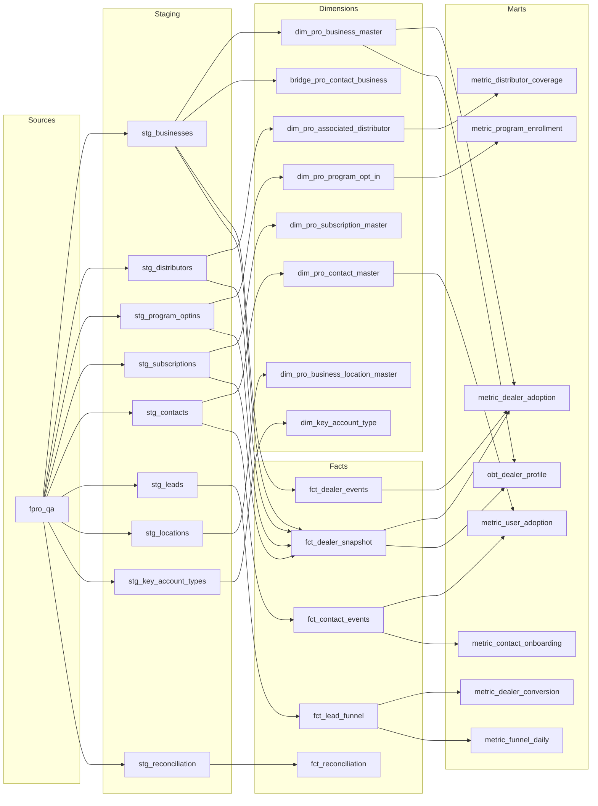
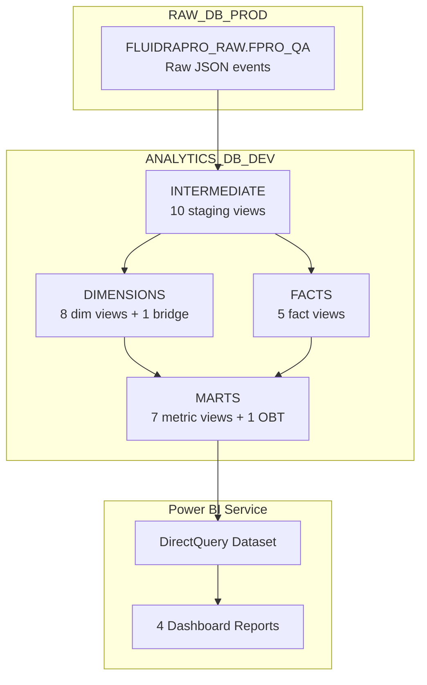

# Fluidra Pro Analytics — Architecture Flow

## End-to-End Data Pipeline

```mermaid
flowchart TB
    subgraph SOURCE["Source Systems"]
        FPRO[Fluidra Pro Platform<br/>pro-platform-core]
        SF[Salesforce CRM]
        KAFKA[MSK Kafka<br/>psot_poolpro_inbound]
    end

    subgraph INGESTION["Ingestion Layer"]
        CONNECTOR[Snowflake Kafka Connector]
        SNOWPIPE[Snowpipe<br/>Auto-ingest]
    end

    subgraph RAW["RAW_DB_PROD.FLUIDRAPRO_RAW"]
        RAW_TABLE[FPRO_QA<br/>4,043 raw JSON events<br/>Columns: C1, C2]
    end

    subgraph DBT_STAGING["dbt: Staging Layer (views)"]
        direction LR
        STG_BIZ[stg_fpro_qa_businesses<br/>240 rows]
        STG_DIST[stg_fpro_qa_business_distributors<br/>292 rows]
        STG_PROG[stg_fpro_qa_business_program_optins<br/>236 rows]
        STG_SUB[stg_fpro_qa_business_subscriptions<br/>16 rows]
        STG_CON[stg_fpro_qa_contacts<br/>482 rows]
        STG_LEAD[stg_fpro_qa_leads<br/>178 rows]
        STG_LOC[stg_fpro_qa_locations<br/>4 rows]
        STG_KEY[stg_fpro_qa_key_account_types<br/>12 rows]
        STG_RECON[stg_fpro_qa_reconciliation<br/>86 rows]
        STG_GUEST[stg_fpro_qa_guest_technicians<br/>7 rows]
    end

    subgraph DBT_DIMS["dbt: Dimensions (views/tables)"]
        direction LR
        DIM_BIZ[DIM_PRO_BUSINESS_MASTER<br/>240 dealers]
        DIM_CON[DIM_PRO_CONTACT_MASTER<br/>485 contacts]
        DIM_DIST[DIM_PRO_ASSOCIATED_DISTRIBUTOR<br/>292 links]
        DIM_PROG[DIM_PRO_PROGRAM_OPT_IN<br/>236 enrollments]
        DIM_SUB[DIM_PRO_SUBSCRIPTION_MASTER<br/>16 subscriptions]
        DIM_LOC[DIM_PRO_BUSINESS_LOCATION_MASTER<br/>236 locations]
        DIM_KEY[DIM_KEY_ACCOUNT_TYPE<br/>12 types]
        BRIDGE[BRIDGE_PRO_CONTACT_BUSINESS<br/>249 links]
    end

    subgraph DBT_FACTS["dbt: Facts (views)"]
        direction LR
        FCT_DE[FCT_DEALER_EVENTS<br/>~1,016 events]
        FCT_CE[FCT_CONTACT_EVENTS<br/>~2,723 events]
        FCT_LF[FCT_LEAD_FUNNEL<br/>~610 transitions]
        FCT_DS[FCT_DEALER_SNAPSHOT<br/>240 profiles]
        FCT_RC[FCT_RECONCILIATION<br/>86 runs]
    end

    subgraph DBT_MARTS["dbt: Metrics / Marts (views)"]
        direction LR
        M_ADOPT[METRIC_DEALER_ADOPTION<br/>KPI 1.1-1.5]
        M_CONV[METRIC_DEALER_CONVERSION<br/>KPI 2.1-2.4]
        M_USER[METRIC_USER_ADOPTION<br/>KPI 3.1-3.7]
        M_FUNNEL[METRIC_FUNNEL_DAILY]
        M_PROGRAM[METRIC_PROGRAM_ENROLLMENT]
        M_DISTRIB[METRIC_DISTRIBUTOR_COVERAGE]
        M_ONBOARD[METRIC_CONTACT_ONBOARDING]
        OBT[OBT_DEALER_PROFILE<br/>Wide table for BI]
    end

    subgraph BI["Power BI Dashboards"]
        direction LR
        DASH_ADOPT[Dealer Adoption<br/>Dashboard]
        DASH_CONV[Lead Conversion<br/>Dashboard]
        DASH_USER[User Onboarding<br/>Dashboard]
        DASH_HEALTH[Dealer Health<br/>Scorecard]
    end

    %% Flow connections
    FPRO -->|CDC Events| KAFKA
    SF -->|Lead Events| KAFKA
    KAFKA --> CONNECTOR
    CONNECTOR --> SNOWPIPE
    SNOWPIPE --> RAW_TABLE

    RAW_TABLE --> STG_BIZ
    RAW_TABLE --> STG_DIST
    RAW_TABLE --> STG_PROG
    RAW_TABLE --> STG_SUB
    RAW_TABLE --> STG_CON
    RAW_TABLE --> STG_LEAD
    RAW_TABLE --> STG_LOC
    RAW_TABLE --> STG_KEY
    RAW_TABLE --> STG_RECON
    RAW_TABLE --> STG_GUEST

    STG_BIZ --> DIM_BIZ
    STG_DIST --> DIM_DIST
    STG_PROG --> DIM_PROG
    STG_SUB --> DIM_SUB
    STG_CON --> DIM_CON
    STG_LOC --> DIM_LOC
    STG_KEY --> DIM_KEY
    STG_BIZ --> BRIDGE

    STG_BIZ --> FCT_DE
    STG_CON --> FCT_CE
    STG_LEAD --> FCT_LF
    STG_BIZ --> FCT_DS
    STG_RECON --> FCT_RC

    DIM_BIZ --> M_ADOPT
    DIM_CON --> M_USER
    FCT_DE --> M_ADOPT
    FCT_LF --> M_CONV
    FCT_LF --> M_FUNNEL
    FCT_CE --> M_USER
    FCT_CE --> M_ONBOARD
    DIM_PROG --> M_PROGRAM
    DIM_DIST --> M_DISTRIB
    FCT_DS --> M_ADOPT
    DIM_BIZ --> OBT
    FCT_DS --> OBT

    M_ADOPT --> DASH_ADOPT
    M_CONV --> DASH_CONV
    M_USER --> DASH_USER
    OBT --> DASH_HEALTH
    M_FUNNEL --> DASH_CONV
    M_ONBOARD --> DASH_USER
    M_PROGRAM --> DASH_HEALTH
    M_DISTRIB --> DASH_HEALTH
```

---

## Layer Descriptions

### 1. Source Systems

| System | What It Emits | Protocol |
|--------|--------------|----------|
| Fluidra Pro Platform (`pro-platform-core`) | Business, Contact, Location, Reconciliation events | EventBridge → Kafka |
| Salesforce CRM | Lead approved/rejected events | CDC → Kafka |
| MSK Kafka (`psot_poolpro_inbound`) | Unified event stream | Topic partition 0 |

### 2. Ingestion Layer

| Component | Role |
|-----------|------|
| Snowflake Kafka Connector | Consumes from MSK topic, writes to raw table |
| Snowpipe | Auto-ingests new messages into `FPRO_QA` |

**Raw table structure:** 2 VARCHAR columns (`C1` = metadata JSON, `C2` = payload JSON)

### 3. dbt Staging (ANALYTICS_DB_DEV.INTERMEDIATE)

| Pattern | What It Does |
|---------|-------------|
| PARSE_JSON | Extracts typed columns from raw JSON |
| LATERAL FLATTEN | Explodes nested arrays (distributors, programs, subscriptions) |
| ROW_NUMBER + QUALIFY | Deduplicates by entity PK, keeps latest event |
| WHERE C1 != 'RECORD_METADATA' | Filters out header row |

**10 staging views** covering all 18 event types.

### 4. dbt Dimensions (ANALYTICS_DB_DEV.DIMENSIONS)

| Design | Principle |
|--------|-----------|
| Thin dims | Attributes only — no counts, no measures |
| Snowflake schema | Central dim (Business) with outrigger sub-dims |
| Bridge table | Resolves NULL FK on contact events |
| Current state | Latest event per entity (no history) |

**8 dimension views** + 1 bridge.

### 5. dbt Facts (ANALYTICS_DB_DEV.FACTS)

| Fact Type | Pattern |
|-----------|---------|
| Transactional (`FCT_DEALER_EVENTS`, `FCT_CONTACT_EVENTS`, `FCT_LEAD_FUNNEL`) | One row per event — measures what happened |
| Periodic Snapshot (`FCT_DEALER_SNAPSHOT`) | One row per dealer — measures current state |
| Operational (`FCT_RECONCILIATION`) | One row per data pipeline run |

**5 fact views.**

### 6. dbt Marts / Metrics (ANALYTICS_DB_DEV.MARTS)

| View | KPIs | Consumers |
|------|------|-----------|
| `METRIC_DEALER_ADOPTION` | 1.1–1.5 | Dealer Adoption Dashboard |
| `METRIC_DEALER_CONVERSION` | 2.1–2.4 | Lead Conversion Dashboard |
| `METRIC_USER_ADOPTION` | 3.1–3.7 | User Onboarding Dashboard |
| `METRIC_FUNNEL_DAILY` | Daily breakdown | Lead Conversion Dashboard |
| `METRIC_PROGRAM_ENROLLMENT` | By program | Dealer Health Scorecard |
| `METRIC_DISTRIBUTOR_COVERAGE` | By distributor | Dealer Health Scorecard |
| `METRIC_CONTACT_ONBOARDING` | By contact type | User Onboarding Dashboard |
| `OBT_DEALER_PROFILE` | Wide table | All dashboards (drill-down) |

**7 metric views + 1 OBT.**

### 7. Power BI Dashboards

| Dashboard | Source Views | Key Visuals |
|-----------|-------------|-------------|
| **Dealer Adoption** | METRIC_DEALER_ADOPTION, OBT_DEALER_PROFILE | Active vs Inactive pie, New dealers trend, Setup completion rate |
| **Lead Conversion** | METRIC_DEALER_CONVERSION, METRIC_FUNNEL_DAILY | Funnel waterfall, Rejection rate card, Daily approval trend |
| **User Onboarding** | METRIC_USER_ADOPTION, METRIC_CONTACT_ONBOARDING | Login rate by contact type, Time-to-first-login, Never-setup count |
| **Dealer Health Scorecard** | OBT_DEALER_PROFILE, METRIC_PROGRAM_ENROLLMENT, METRIC_DISTRIBUTOR_COVERAGE | Health status distribution, Program activation rates, Distributor coverage heatmap |

---

## dbt Model Dependency Graph

---

## Snowflake Database Layout

---

## Refresh Strategy

| Layer | Materialization | Refresh Frequency | Trigger |
|-------|:-:|:-:|---|
| Raw | Table (Snowpipe) | Real-time | Kafka message arrival |
| Staging | View | On-query | N/A (computed at read) |
| Dimensions | Table (full refresh) | Daily 6am | dbt Cloud scheduled job |
| Facts | View | On-query | N/A (computed at read) |
| Marts | View | On-query | N/A (computed at read) |
| Power BI | DirectQuery | On-dashboard-load | User opens report |

---

## KPI Coverage by Dashboard

| Dashboard | KPIs | Status |
|-----------|:----:|:------:|
| Dealer Adoption | 1.1, 1.2, 1.3, 1.4, 1.5 | ✅ All computable |
| Lead Conversion | 2.1, 2.2, 2.3, 2.4 | ✅ All computable |
| User Onboarding | 3.1, 3.2, 3.3, 3.4, 3.5, 3.6, 3.7 | ✅ All computable |
| Engagement (Stickiness) | 4.1, 4.2 | ❌ Needs Cognito login stream |
| Revenue | 5.1, 5.2 | ❌ Needs PSOT revenue data |

**16 of 20 KPIs computable** from current pipeline. Remaining 4 require additional data sources.
