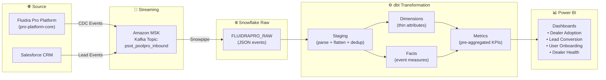

# Fluidra Pro Analytics — Architecture Flow

## End-to-End Data Pipeline

---

## Layer Detail

```mermaid
flowchart TB
    subgraph RAW["Raw Layer"]
        R1["FPRO_QA\n18 event types\nJSON payload"]
    end

    subgraph STAGING["Staging Layer"]
        S1["stg_businesses"]
        S2["stg_contacts"]
        S3["stg_leads"]
        S4["stg_distributors"]
        S5["stg_program_optins"]
        S6["stg_subscriptions"]
        S7["stg_locations"]
        S8["stg_key_account_types"]
        S9["stg_reconciliation"]
    end

    subgraph DIMS["Dimensions"]
        D1["DIM_PRO_BUSINESS_MASTER"]
        D2["DIM_PRO_CONTACT_MASTER"]
        D3["DIM_PRO_ASSOCIATED_DISTRIBUTOR"]
        D4["DIM_PRO_PROGRAM_OPT_IN"]
        D5["DIM_PRO_SUBSCRIPTION_MASTER"]
        D6["DIM_PRO_BUSINESS_LOCATION_MASTER"]
        D7["DIM_KEY_ACCOUNT_TYPE"]
        DB["BRIDGE_PRO_CONTACT_BUSINESS"]
    end

    subgraph FACTS["Facts"]
        F1["FCT_DEALER_EVENTS"]
        F2["FCT_CONTACT_EVENTS"]
        F3["FCT_LEAD_FUNNEL"]
        F4["FCT_DEALER_SNAPSHOT"]
    end

    subgraph METRICS["Metric Views"]
        M1["METRIC_DEALER_ADOPTION\nKPI 1.1 – 1.5"]
        M2["METRIC_DEALER_CONVERSION\nKPI 2.1 – 2.4"]
        M3["METRIC_USER_ADOPTION\nKPI 3.1 – 3.7"]
        M4["METRIC_FUNNEL_DAILY"]
        M5["METRIC_PROGRAM_ENROLLMENT"]
        M6["METRIC_DISTRIBUTOR_COVERAGE"]
        M7["METRIC_CONTACT_ONBOARDING"]
        M8["OBT_DEALER_PROFILE"]
    end

    subgraph PBI["Power BI Reports"]
        P1["Dealer Adoption"]
        P2["Lead Conversion"]
        P3["User Onboarding"]
        P4["Dealer Health Scorecard"]
    end

    R1 --> S1 & S2 & S3 & S4 & S5 & S6 & S7 & S8 & S9

    S1 --> D1
    S2 --> D2
    S4 --> D3
    S5 --> D4
    S6 --> D5
    S7 --> D6
    S8 --> D7
    S1 --> DB

    S1 --> F1
    S2 --> F2
    S3 --> F3
    S1 & S4 & S5 & S6 --> F4

    D1 & F1 & F4 --> M1
    F3 --> M2
    D2 & F2 --> M3
    F3 --> M4
    D4 --> M5
    D3 --> M6
    F2 --> M7
    D1 & F4 --> M8

    M1 --> P1
    M2 & M4 --> P2
    M3 & M7 --> P3
    M5 & M6 & M8 --> P4
```

---

## Pipeline Summary

| Layer | Tool | Purpose |
|-------|------|---------|
| Source | Fluidra Pro + Salesforce | Emit CDC events |
| Streaming | Amazon MSK (Kafka) | Unified event transport |
| Ingestion | Snowpipe | Auto-load JSON into Snowflake |
| Staging | dbt (views) | Parse JSON, flatten arrays, deduplicate |
| Dimensions | dbt (tables) | Thin descriptive attributes per entity |
| Facts | dbt (views) | Event-grain measures + periodic snapshot |
| Metrics | dbt (views) | Pre-aggregated KPIs for dashboards |
| Reporting | Power BI (DirectQuery) | Executive dashboards + drill-down |

---
