# dbt Models — Production Strategy

## Execution Sequence

```mermaid
flowchart TB
    subgraph STEP1["Step 1: Staging (incremental)"]
        direction LR
        S1["stg_fpro_qa_businesses"]
        S2["stg_fpro_qa_contacts"]
        S3["stg_fpro_qa_leads"]
        S4["stg_fpro_qa_business_distributors"]
        S5["stg_fpro_qa_business_program_optins"]
        S6["stg_fpro_qa_business_subscriptions"]
        S7["stg_fpro_qa_locations"]
        S8["stg_fpro_qa_key_account_types"]
        S9["stg_fpro_qa_reconciliation"]
    end

    subgraph STEP2["Step 2: Bridge (incremental)"]
        B1["bridge_pro_contact_business"]
    end

    subgraph STEP3["Step 3: Dimensions (table - full refresh)"]
        direction LR
        D1["dim_pro_business_master"]
        D2["dim_pro_contact_master"]
        D3["dim_pro_associated_distributor"]
        D4["dim_pro_program_opt_in"]
        D5["dim_pro_subscription_master"]
        D6["dim_pro_business_location_master"]
        D7["dim_key_account_type"]
    end

    subgraph STEP4["Step 4: Facts (incremental)"]
        direction LR
        F1["fct_dealer_events"]
        F2["fct_contact_events"]
        F3["fct_lead_funnel"]
        F4["fct_reconciliation"]
    end

    subgraph STEP5["Step 5: Snapshot Fact (table - full refresh)"]
        F5["fct_dealer_snapshot"]
    end

    subgraph STEP6["Step 6: Metrics (view)"]
        direction LR
        M1["metric_dealer_adoption"]
        M2["metric_dealer_conversion"]
        M3["metric_user_adoption"]
        M4["metric_funnel_daily"]
        M5["metric_program_enrollment"]
        M6["metric_distributor_coverage"]
        M7["metric_contact_onboarding"]
        M8["obt_dealer_profile"]
    end

    STEP1 --> STEP2 --> STEP3 --> STEP4 --> STEP5 --> STEP6
```



---

## Model Strategy (Production — Large Data)

### Step 1: Staging Models

| Model | Materialization | Strategy | Unique Key | Incremental Logic |
|-------|:-:|---|---|---|
| `stg_fpro_qa_businesses` | **incremental** | Append new events, dedup by PK | `event_id` | `WHERE event_time > (SELECT MAX(event_time) FROM {{ this }})` |
| `stg_fpro_qa_contacts` | **incremental** | Append new events, dedup by PK | `event_id` | Same |
| `stg_fpro_qa_leads` | **incremental** | Append all lead decisions | `event_id` | Same |
| `stg_fpro_qa_business_distributors` | **incremental** | Append new flattened rows | `event_id` + array index | Same |
| `stg_fpro_qa_business_program_optins` | **incremental** | Append new flattened rows | `event_id` + array index | Same |
| `stg_fpro_qa_business_subscriptions` | **incremental** | Append new flattened rows | `event_id` + array index | Same |
| `stg_fpro_qa_locations` | **incremental** | Append new events | `event_id` | Same |
| `stg_fpro_qa_key_account_types` | **incremental** | Append new events | `event_id` | Same |
| `stg_fpro_qa_reconciliation` | **incremental** | Append new runs | `event_id` | Same |

**Why incremental:** Raw table grows continuously via Kafka. Re-parsing ALL JSON every run is expensive at scale (100K+ events). Incremental only processes events since last run.

**Pattern:**
```sql
{{
  config(
    materialized='incremental',
    unique_key='event_id',
    incremental_strategy='append'
  )
}}

...


WHERE payload:time::TIMESTAMP_NTZ > (SELECT MAX(event_time) FROM {{ this }})

```

---

### Step 2: Bridge

| Model | Materialization | Strategy | Why |
|-------|:-:|---|---|
| `bridge_pro_contact_business` | **incremental** | Merge new contact-dealer links | New business events may introduce new primaryContact references |

**Pattern:**
```sql
{{
  config(
    materialized='incremental',
    unique_key=['pro_business_id', 'pro_contact_id'],
    incremental_strategy='merge'
  )
}}
```

---

### Step 3: Dimensions

| Model | Materialization | Strategy | Why |
|-------|:-:|---|---|
| `dim_pro_business_master` | **table** (full refresh) | Rebuild from staging | Small row count (thousands), needs aggregation from child tables, simple to reason about |
| `dim_pro_contact_master` | **table** (full refresh) | Rebuild from staging + bridge | Needs bridge join — simpler as full rebuild |
| `dim_pro_associated_distributor` | **table** (full refresh) | Latest state per composite key | Small, fast rebuild |
| `dim_pro_program_opt_in` | **table** (full refresh) | Latest state per (biz, program) | Small, fast rebuild |
| `dim_pro_subscription_master` | **table** (full refresh) | Latest state per subscription_id | Very small |
| `dim_pro_business_location_master` | **table** (full refresh) | Latest state per location_id | Very small |
| `dim_key_account_type` | **table** (full refresh) | Latest state per type_id | Very small |

**Why full refresh:** Dimensions represent CURRENT STATE. Every run should reflect the latest attributes. At dimension scale (hundreds to low thousands of rows), full refresh takes seconds. The complexity of incremental merge with SCD logic isn't worth it here.

**Pattern:**
```sql
{{
  config(
    materialized='table',
    schema='DIMENSIONS'
  )
}}
```

---

### Step 4: Fact Tables (Event Grain)

| Model | Materialization | Strategy | Unique Key | Why |
|-------|:-:|---|---|---|
| `fct_dealer_events` | **incremental** | Append new events | `event_id` | Event facts grow unbounded — must be incremental |
| `fct_contact_events` | **incremental** | Append new events | `event_id` | Same |
| `fct_lead_funnel` | **incremental** | Append new funnel transitions | `event_id` | Same |
| `fct_reconciliation` | **incremental** | Append new runs | `event_id` | Same |

**Why incremental:** Fact tables are append-only by nature. An event that happened yesterday never changes. Only new events need processing.

**Pattern:**
```sql
{{
  config(
    materialized='incremental',
    unique_key='event_id',
    incremental_strategy='append',
    on_schema_change='append_new_columns'
  )
}}

...


WHERE event_time > (SELECT MAX(event_time) FROM {{ this }})

```

---

### Step 5: Snapshot Fact

| Model | Materialization | Strategy | Why |
|-------|:-:|---|---|
| `fct_dealer_snapshot` | **table** (full refresh) | Recalculate all dealer metrics | Depends on dims + staging aggregates — simpler as rebuild |

**Why full refresh:** This computes `days_since_last_login`, distributor counts, program counts etc. These are point-in-time calculations that must reflect TODAY's state. Full refresh ensures correctness.

**Future enhancement:** In production, convert to **incremental append** with `snapshot_date = CURRENT_DATE` to build historical trend data (one row per dealer per day).

**Pattern (future):**
```sql
{{
  config(
    materialized='incremental',
    unique_key=['pro_business_id', 'snapshot_date'],
    incremental_strategy='merge'
  )
}}

-- Only insert today's snapshot (not recalculate history)
SELECT *, CURRENT_DATE AS snapshot_date
FROM computed_metrics

WHERE snapshot_date > (SELECT MAX(snapshot_date) FROM {{ this }})

```

---

### Step 6: Metrics / Marts

| Model | Materialization | Strategy | Why |
|-------|:-:|---|---|
| `metric_dealer_adoption` | **view** | Always compute fresh | KPIs must reflect real-time state |
| `metric_dealer_conversion` | **view** | Always compute fresh | Same |
| `metric_user_adoption` | **view** | Always compute fresh | Same |
| `metric_funnel_daily` | **view** | Always compute fresh | Same |
| `metric_program_enrollment` | **view** | Always compute fresh | Same |
| `metric_distributor_coverage` | **view** | Always compute fresh | Same |
| `metric_contact_onboarding` | **view** | Always compute fresh | Same |
| `obt_dealer_profile` | **view** | Always compute fresh | Joins dim + snapshot — must be current |

**Why views:** Metrics are the BI-facing layer. They should always reflect the latest data without waiting for a dbt run. Since they query materialized tables (dims + facts), the view computation is fast (reads from pre-computed tables, not raw JSON).

---

## Summary Table

| Layer | Models | Materialization | Run Frequency | Processing |
|-------|:------:|:-:|:-:|---|
| Staging | 9 | **incremental** | Every 15 min | Parse only NEW events |
| Bridge | 1 | **incremental** | Every 15 min | Merge new links |
| Dimensions | 7 | **table** (full) | Every 6 hours | Rebuild from staging (fast, small) |
| Facts (events) | 4 | **incremental** | Every 15 min | Append only NEW events |
| Facts (snapshot) | 1 | **table** (full) | Daily 6am | Recalculate all dealer metrics |
| Metrics | 8 | **view** | On-query | Computed at read time |
| **Total** | **30** | | | |

---

## dbt Run Commands

```bash
# Full refresh (first run or reset)
dbt run --full-refresh

# Normal incremental run (scheduled every 15 min)
dbt run --select staging facts bridge

# Dimension rebuild (scheduled every 6 hours)
dbt run --select dimensions

# Snapshot rebuild (scheduled daily 6am)
dbt run --select fct_dealer_snapshot

# Everything (rarely needed)
dbt run
```

---

## Production dbt_project.yml Config

```yaml
models:
  fluidra_pro:
    staging:
      +materialized: incremental
      +schema: INTERMEDIATE
      +incremental_strategy: append
    dimensions:
      +materialized: table
      +schema: DIMENSIONS
    facts:
      +materialized: incremental
      +schema: FACTS
      +incremental_strategy: append
    marts:
      +materialized: view
      +schema: MARTS
```

---

## Handling Late-Arriving Events

| Scenario | Solution |
|----------|----------|
| Event arrives with old timestamp | Staging incremental uses `kafka_offset` watermark instead of `event_time` |
| Duplicate events (same event_id) | `unique_key='event_id'` with merge strategy deduplicates |
| Schema evolution (new fields) | `on_schema_change='append_new_columns'` handles gracefully |
| Full backfill needed | `dbt run --full-refresh --select staging facts` |

---

## Monitoring

| Check | dbt Feature | Frequency |
|-------|-------------|:-:|
| Row count anomalies | `dbt test` — `dbt_utils.recency` | Every run |
| NULL PKs | `dbt test` — `not_null` on PKs | Every run |
| Unique violations | `dbt test` — `unique` on PKs | Every run |
| Freshness | `dbt source freshness` | Every 30 min |
| Staging→Dim count match | Custom test | Daily |
