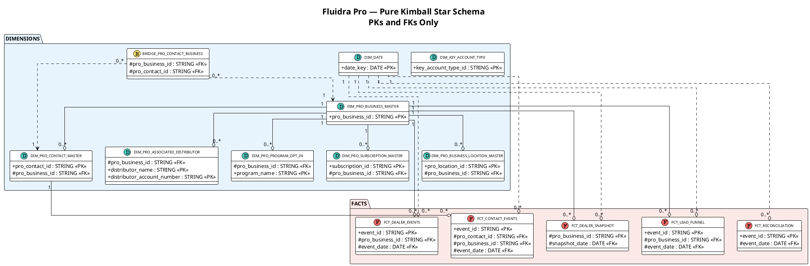

# Pure Kimball Model — PlantUML Diagrams

## Diagram 1: PKs and FKs Only (Compact Relationship View)

---

## Diagram 2: Full Model with All Attributes (Replica of Mermaid ER)

```plantuml
@startuml kimball_full_model
!theme plain
skinparam linetype ortho
skinparam classAttributeIconSize 0
skinparam classFontSize 9

title Fluidra Pro Analytics — Pure Kimball Star Schema (Full Attributes)\nThin Dims (Attributes Only) + Facts (Measures Only)

package "DIMENSIONS (Thin - Attributes Only)" #E8F4FD {

  class DIM_PRO_BUSINESS_MASTER <<(D,#4ECDC4)>> {
    + pro_business_id : STRING <<PK>>
    --
    business_name : STRING
    doing_business_as : STRING
    business_status : STRING {ACTIVE|LEAD|GUEST|REJECTED}
    login_status : STRING {ACTIVE|PENDING}
    customer_type : STRING
    primary_business_type : STRING {BUILDER|SERVICE|RETAILER}
    business_segment : STRING {BUILD|SERVICE|RETAIL}
    channel : STRING {NEW CONSTRUCTION|AFTERMARKET}
    customer_class : STRING
    sales_channel : STRING
    registration_source : STRING {PROWEB|SALESFORCE}
    fluidra_account_number : STRING
    crm_lead_id : STRING
    key_account_type_name : STRING
    key_account_type_role : STRING
    rewards_program_level : STRING
    rewards_achiever_level : STRING
    rewards_program_status : STRING {ACTIVE|PENDING}
    rewards_rebate_pay_type : STRING
    billing_city : STRING
    billing_state : STRING
    billing_zip : STRING
    billing_country : STRING
    rewards_signup_date : TIMESTAMP
    created_at : TIMESTAMP
  }

  class DIM_PRO_CONTACT_MASTER <<(D,#4ECDC4)>> {
    + pro_contact_id : STRING <<PK>>
    # pro_business_id : STRING <<FK via BRIDGE>>
    --
    contact_type : STRING {OWNER|TECHNICIAN|OFFICE ADMIN|CO-OWNER|CSC}
    first_name : STRING
    last_name : STRING
    email : STRING
    login_status : STRING {ACTIVE|PENDING|NOLOGIN|DISABLE_PENDING}
    username : STRING
    cognito_sub_id : STRING
    last_login_date : TIMESTAMP
    contact_status : STRING
    created_at : TIMESTAMP
  }

  class DIM_PRO_BUSINESS_LOCATION_MASTER <<(D,#4ECDC4)>> {
    + pro_location_id : STRING <<PK>>
    # pro_business_id : STRING <<FK>>
    --
    location_type : STRING {PRIMARY_BILL_TO|PRIMARY_SHIP_TO|STORE}
    location_name : STRING
    location_status : STRING
    city : STRING
    state : STRING
    zip : STRING
    country : STRING
  }

  class DIM_PRO_ASSOCIATED_DISTRIBUTOR <<(D,#4ECDC4)>> {
    # pro_business_id : STRING <<FK>>
    + distributor_name : STRING <<PK>>
    + distributor_account_number : STRING <<PK>>
    --
    distributor_account_status : STRING {ACTIVE|PENDING ACTIVE|INACTIVE}
    source : STRING {MANUAL|PROWEB}
    active_date : TIMESTAMP
  }

  class DIM_PRO_PROGRAM_OPT_IN <<(D,#4ECDC4)>> {
    # pro_business_id : STRING <<FK>>
    + program_name : STRING <<PK>>
    --
    program_status : STRING {ACTIVE|PENDING|DECLINED|INACTIVE}
    program_opt_in_date : TIMESTAMP
    source : STRING
  }

  class DIM_PRO_SUBSCRIPTION_MASTER <<(D,#4ECDC4)>> {
    + subscription_id : STRING <<PK>>
    # pro_business_id : STRING <<FK>>
    --
    subscription_name : STRING {ION POOL CARE}
    subscription_status : STRING {ACTIVE}
    program_start_date : TIMESTAMP
  }

  class DIM_KEY_ACCOUNT_TYPE <<(D,#4ECDC4)>> {
    + key_account_type_id : STRING <<PK>>
    --
    key_account_type_name : STRING
    key_account_type_role : STRING
    customer_class : STRING
    sales_channel : STRING
  }

  class DIM_DATE <<(D,#4ECDC4)>> {
    + date_key : DATE <<PK>>
    --
    day_of_week : INT
    week_of_year : INT
    month_number : INT
    quarter : INT
    year : INT
    is_weekend : BOOLEAN
  }

  class BRIDGE_PRO_CONTACT_BUSINESS <<(B,#FFE66D)>> {
    # pro_business_id : STRING <<FK>>
    # pro_contact_id : STRING <<FK>>
    --
    relationship_type : STRING {PRIMARY_CONTACT}
  }
}

package "FACTS (Measures Only)" #FBE9E7 {

  class FCT_DEALER_EVENTS <<(F,#FF6B6B)>> {
    + event_id : STRING <<PK>>
    # pro_business_id : STRING <<FK>>
    # event_date : DATE <<FK>>
    --
    event_time : TIMESTAMP
    event_detail_type : STRING
    metadata_event_type : STRING
    distributor_count : INT
    program_opt_in_count : INT
    subscription_count : INT
    is_created_event : INT {0|1}
    is_approved_event : INT {0|1}
    is_rejected_event : INT {0|1}
    is_creation_failed : INT {0|1}
    failure_reason : STRING
  }

  class FCT_CONTACT_EVENTS <<(F,#FF6B6B)>> {
    + event_id : STRING <<PK>>
    # pro_contact_id : STRING <<FK>>
    # pro_business_id : STRING <<FK>>
    # event_date : DATE <<FK>>
    --
    event_time : TIMESTAMP
    contact_type : STRING
    is_created_event : INT {0|1}
    is_login_created_event : INT {0|1}
    is_deleted_event : INT {0|1}
  }

  class FCT_LEAD_FUNNEL <<(F,#FF6B6B)>> {
    + event_id : STRING <<PK>>
    # pro_business_id : STRING <<FK>>
    # event_date : DATE <<FK>>
    --
    event_time : TIMESTAMP
    funnel_stage : STRING {GUEST|LEAD|APPROVED|REJECTED|FAILED}
    crm_lead_id : STRING
    seconds_in_stage : INT
    failure_reason : STRING
  }

  class FCT_DEALER_SNAPSHOT <<(F,#FF6B6B)>> {
    # pro_business_id : STRING <<FK>>
    # snapshot_date : DATE <<FK>>
    --
    total_distributor_count : INT
    active_distributor_count : INT
    total_program_count : INT
    active_program_count : INT
    total_subscription_count : INT
    active_subscription_count : INT
    total_contacts : INT
    active_contacts : INT
    days_since_last_login : INT
    health_status : STRING
  }

  class FCT_RECONCILIATION <<(F,#FF6B6B)>> {
    + event_id : STRING <<PK>>
    # event_date : DATE <<FK>>
    --
    run_id : STRING
    entity : STRING
    dq_structural_version : STRING
    gatekeeper_policy_version : STRING
    mastering_rules_version : STRING
  }
}

' === Dimension to Dimension ===
DIM_PRO_BUSINESS_MASTER "1" --o "0..*" DIM_PRO_CONTACT_MASTER : pro_business_id
DIM_PRO_BUSINESS_MASTER "1" --o "0..*" DIM_PRO_BUSINESS_LOCATION_MASTER : pro_business_id
DIM_PRO_BUSINESS_MASTER "1" --o "0..*" DIM_PRO_ASSOCIATED_DISTRIBUTOR : pro_business_id
DIM_PRO_BUSINESS_MASTER "1" --o "0..*" DIM_PRO_PROGRAM_OPT_IN : pro_business_id
DIM_PRO_BUSINESS_MASTER "1" --o "0..*" DIM_PRO_SUBSCRIPTION_MASTER : pro_business_id
BRIDGE_PRO_CONTACT_BUSINESS "0..*" ..> "1" DIM_PRO_BUSINESS_MASTER : pro_business_id
BRIDGE_PRO_CONTACT_BUSINESS "0..*" ..> "1" DIM_PRO_CONTACT_MASTER : pro_contact_id

' === Fact to Dimension ===
DIM_PRO_BUSINESS_MASTER "1" --o "0..*" FCT_DEALER_EVENTS : pro_business_id
DIM_PRO_BUSINESS_MASTER "1" --o "0..*" FCT_LEAD_FUNNEL : pro_business_id
DIM_PRO_BUSINESS_MASTER "1" --o "0..*" FCT_DEALER_SNAPSHOT : pro_business_id
DIM_PRO_CONTACT_MASTER "1" --o "0..*" FCT_CONTACT_EVENTS : pro_contact_id
DIM_DATE "1" ..o "0..*" FCT_DEALER_EVENTS : event_date
DIM_DATE "1" ..o "0..*" FCT_CONTACT_EVENTS : event_date
DIM_DATE "1" ..o "0..*" FCT_LEAD_FUNNEL : event_date
DIM_DATE "1" ..o "0..*" FCT_DEALER_SNAPSHOT : snapshot_date
DIM_DATE "1" ..o "0..*" FCT_RECONCILIATION : event_date

@enduml
```

---

## How to Render

| Tool | Steps |
|------|-------|
| **PlantUML Online** | Paste code at [plantuml.com/plantuml](https://www.plantuml.com/plantuml) |
| **VS Code** | Install PlantUML extension → open file → Alt+D |
| **IntelliJ** | Built-in PlantUML → right-click → Show Diagram |

---

## Legend

| Symbol | Meaning |
|--------|---------|
| **(D)** teal circle | Dimension (thin — attributes only) |
| **(F)** red circle | Fact (measures + FK references) |
| **(B)** yellow circle | Bridge (resolves broken FK) |
| `+` prefix | Primary Key |
| `#` prefix | Foreign Key |
| Solid line `--o` | Strong relationship (always joined) |
| Dotted line `..o` | Soft relationship (role-playing or optional) |
| `"1" --o "0..*"` | One-to-many cardinality |
