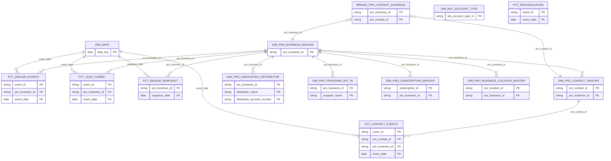

# Pure Kimball Dimensional Model — Thin Dims + Proper Facts

## Design Principle

- **Dimensions** = descriptive attributes ONLY (text, categories, flags, dates). No counts, no aggregates.
- **Facts** = numeric measures + FK references to dimensions. One row per event OR per snapshot period.
- **OBT** = denormalized wide table for BI tools. Joins dim + fact for convenience.

---

## 1. Mermaid ER Diagram — Pure Kimball (PK/FK Only)



---

## 2. What Changed from Current Model

| Object | Before (Current) | After (Pure Kimball) |
|--------|-----------------|---------------------|
| `DIM_PRO_BUSINESS_MASTER` (old — wide) | Had 11 count/aggregate columns | → Renamed `OBT_DEALER_PROFILE` (BI layer) |
| `DIM_PRO_BUSINESS_MASTER` (new — thin) | Didn't exist as thin dim | → Pure attributes only, no counts |
| `FCT_DEALER_SNAPSHOT` (new) | Didn't exist | → Periodic snapshot with all numeric measures |
| `DIM_PRO_CONTACT_MASTER` | Has `days_since_last_login` | → Remove calculated numeric, keep only attributes |
| `DIM_PRO_ASSOCIATED_DISTRIBUTOR` | ✅ Already correct | No change needed |
| `DIM_PRO_PROGRAM_OPT_IN` | ✅ Already correct | No change needed |
| `DIM_PRO_SUBSCRIPTION_MASTER` | ✅ Already correct | No change needed |
| `DIM_PRO_BUSINESS_LOCATION_MASTER` | ✅ Already correct | No change needed |
| `DIM_KEY_ACCOUNT_TYPE` | ✅ Already correct | No change needed |
| `BRIDGE_PRO_CONTACT_BUSINESS` | ✅ Already correct | No change needed |

---

## 3. SQL — Only Changed/New Objects

### DIM_PRO_BUSINESS_MASTER (NEW — thin, attributes only)

```sql
CREATE OR REPLACE VIEW ANALYTICS_DB_DEV.DIMENSIONS.DIM_PRO_BUSINESS_MASTER AS
SELECT
    pro_business_id,
    business_name,
    doing_business_as,
    business_status,
    login_status,
    registration_source,
    customer_type,
    primary_business_type,
    business_segment,
    channel,
    customer_class,
    sales_channel,
    primary_business_email,
    primary_business_phone,
    website,
    is_primary_key_account,
    key_account_type_name,
    key_account_type_role,
    fluidra_account_number,
    crm_lead_id,
    web_account_id,
    is_pro_login_allowed,
    terms_accepted,
    e_statement_enabled,
    is_marcom_consent,
    tse_violator,
    -- Rewards attributes (descriptors, not measures)
    rewards_program_level,
    rewards_achiever_level,
    rewards_program_status,
    rewards_rebate_pay_type,
    rewards_region,
    rewards_auto_zodiac,
    rewards_signup_date,
    -- Primary contact attributes (embedded 1:1)
    primary_contact_id,
    primary_contact_type,
    primary_contact_first_name,
    primary_contact_last_name,
    primary_contact_login_status,
    primary_contact_cognito_sub_id,
    -- Location attributes
    billing_location_id,
    billing_city,
    billing_state,
    billing_zip,
    billing_country,
    shipping_location_id,
    shipping_city,
    shipping_state,
    -- Sales rep attributes
    sales_rep_name,
    sales_rep_email,
    -- UTM (descriptors)
    utm_source,
    utm_medium,
    utm_campaign,
    -- Audit
    created_at,
    created_by,
    updated_at,
    event_time AS last_event_time
FROM ANALYTICS_DB_DEV.INTERMEDIATE.STG_FPRO_QA_BUSINESSES;
```

### DIM_PRO_CONTACT_MASTER (UPDATED — remove calculated measure)

```sql
-- Change from current: REMOVED days_since_last_login (measure)
-- Kept last_login_date as a timestamp attribute (it's a descriptor of "when did they last login")
CREATE OR REPLACE VIEW ANALYTICS_DB_DEV.DIMENSIONS.DIM_PRO_CONTACT_MASTER AS
WITH contact_standalone AS (SELECT * FROM ANALYTICS_DB_DEV.INTERMEDIATE.STG_FPRO_QA_CONTACTS),
bridge AS (
    SELECT DISTINCT
        PARSE_JSON(C2):detail.data.proBusinessId::STRING AS pro_business_id,
        PARSE_JSON(C2):detail.data.primaryContact.proContactId::STRING AS pro_contact_id
    FROM RAW_DB_PROD.FLUIDRAPRO_RAW.FPRO_QA
    WHERE C1 != 'RECORD_METADATA'
      AND PARSE_JSON(C2):"detail-type"::STRING LIKE '%pro-business-master%'
      AND PARSE_JSON(C2):detail.data.primaryContact.proContactId IS NOT NULL
      AND PARSE_JSON(C2):detail.data.proBusinessId IS NOT NULL
)
SELECT
    c.pro_contact_id,
    COALESCE(c.pro_business_id, b.pro_business_id) AS pro_business_id,
    c.contact_type,
    c.first_name,
    c.last_name,
    c.email,
    c.phone_number,
    c.login_status,
    c.username,
    c.cognito_sub_id,
    c.web_user_id,
    c.last_login_date,          -- timestamp attribute (NOT a measure)
    c.contact_status,
    c.is_deleted_event,
    c.created_at,
    c.updated_at,
    c.event_time AS last_event_time
FROM contact_standalone c
LEFT JOIN bridge b ON c.pro_contact_id = b.pro_contact_id;
```

### FCT_DEALER_SNAPSHOT (NEW — periodic snapshot fact)

```sql
-- This captures the dealer's numeric profile at current point in time.
-- In production, this would be materialized as a TABLE with daily inserts (append-only).
-- For POC, it's a view showing current state.
CREATE OR REPLACE VIEW ANALYTICS_DB_DEV.FACTS.FCT_DEALER_SNAPSHOT AS
WITH dealer AS (
    SELECT * FROM ANALYTICS_DB_DEV.INTERMEDIATE.STG_FPRO_QA_BUSINESSES
),
dist_counts AS (
    SELECT pro_business_id,
        COUNT(*) AS total_distributor_count,
        COUNT(CASE WHEN distributor_account_status = 'ACTIVE' THEN 1 END) AS active_distributor_count,
        COUNT(CASE WHEN distributor_account_status = 'PENDING ACTIVE' THEN 1 END) AS pending_distributor_count,
        COUNT(CASE WHEN distributor_account_status IN ('INACTIVE','PENDING INACTIVE') THEN 1 END) AS inactive_distributor_count
    FROM ANALYTICS_DB_DEV.INTERMEDIATE.STG_FPRO_QA_BUSINESS_DISTRIBUTORS
    GROUP BY pro_business_id
),
prog_counts AS (
    SELECT pro_business_id,
        COUNT(*) AS total_program_count,
        COUNT(CASE WHEN program_status = 'ACTIVE' THEN 1 END) AS active_program_count,
        COUNT(CASE WHEN program_status = 'PENDING' THEN 1 END) AS pending_program_count,
        COUNT(CASE WHEN program_status = 'DECLINED' THEN 1 END) AS declined_program_count
    FROM ANALYTICS_DB_DEV.INTERMEDIATE.STG_FPRO_QA_BUSINESS_PROGRAM_OPTINS
    GROUP BY pro_business_id
),
sub_counts AS (
    SELECT pro_business_id,
        COUNT(*) AS total_subscription_count,
        COUNT(CASE WHEN subscription_status = 'ACTIVE' THEN 1 END) AS active_subscription_count
    FROM ANALYTICS_DB_DEV.INTERMEDIATE.STG_FPRO_QA_BUSINESS_SUBSCRIPTIONS
    GROUP BY pro_business_id
),
contact_counts AS (
    SELECT b.pro_business_id,
        COUNT(*) AS total_contacts,
        COUNT(CASE WHEN c.login_status = 'ACTIVE' THEN 1 END) AS active_contacts
    FROM ANALYTICS_DB_DEV.DIMENSIONS.BRIDGE_PRO_CONTACT_BUSINESS b
    JOIN ANALYTICS_DB_DEV.INTERMEDIATE.STG_FPRO_QA_CONTACTS c ON b.pro_contact_id = c.pro_contact_id
    GROUP BY b.pro_business_id
)
SELECT
    d.pro_business_id,
    CURRENT_DATE AS snapshot_date,
    -- Distributor measures
    COALESCE(dc.total_distributor_count, 0) AS total_distributor_count,
    COALESCE(dc.active_distributor_count, 0) AS active_distributor_count,
    COALESCE(dc.pending_distributor_count, 0) AS pending_distributor_count,
    COALESCE(dc.inactive_distributor_count, 0) AS inactive_distributor_count,
    -- Program measures
    COALESCE(pc.total_program_count, 0) AS total_program_count,
    COALESCE(pc.active_program_count, 0) AS active_program_count,
    COALESCE(pc.pending_program_count, 0) AS pending_program_count,
    COALESCE(pc.declined_program_count, 0) AS declined_program_count,
    -- Subscription measures
    COALESCE(sc.total_subscription_count, 0) AS total_subscription_count,
    COALESCE(sc.active_subscription_count, 0) AS active_subscription_count,
    -- Contact measures
    COALESCE(cc.total_contacts, 0) AS total_contacts,
    COALESCE(cc.active_contacts, 0) AS active_contacts,
    -- Login measure
    DATEDIFF('day', d.primary_contact_last_login, CURRENT_TIMESTAMP()) AS days_since_last_login,
    -- Derived health (this is a derived CATEGORY placed on the fact for convenience)
    CASE
        WHEN d.login_status = 'ACTIVE' AND d.primary_contact_last_login >= DATEADD('day', -30, CURRENT_TIMESTAMP()) THEN 'HEALTHY'
        WHEN d.login_status = 'ACTIVE' AND (d.primary_contact_last_login < DATEADD('day', -30, CURRENT_TIMESTAMP()) OR d.primary_contact_last_login IS NULL) THEN 'AT_RISK'
        WHEN d.login_status = 'PENDING' THEN 'NOT_ONBOARDED'
        WHEN d.business_status = 'GUEST' THEN 'GUEST'
        WHEN d.business_status = 'REJECTED' THEN 'REJECTED'
        ELSE 'UNKNOWN'
    END AS health_status
FROM dealer d
LEFT JOIN dist_counts dc ON d.pro_business_id = dc.pro_business_id
LEFT JOIN prog_counts pc ON d.pro_business_id = pc.pro_business_id
LEFT JOIN sub_counts sc ON d.pro_business_id = sc.pro_business_id
LEFT JOIN contact_counts cc ON d.pro_business_id = cc.pro_business_id;
```

### OBT_DEALER_PROFILE (RENAMED — BI consumption layer)

```sql
-- This is the EXISTING DIM_PRO_BUSINESS_MASTER, just renamed.
-- It's NOT a dimension. It's a One Big Table for BI tools.
-- Joins DIM_PRO_BUSINESS_MASTER attributes + FCT_DEALER_SNAPSHOT measures in one wide row.
CREATE OR REPLACE VIEW ANALYTICS_DB_DEV.MARTS.OBT_DEALER_PROFILE AS
SELECT
    d.*,
    f.total_distributor_count,
    f.active_distributor_count,
    f.pending_distributor_count,
    f.inactive_distributor_count,
    f.total_program_count,
    f.active_program_count,
    f.pending_program_count,
    f.declined_program_count,
    f.total_subscription_count,
    f.active_subscription_count,
    f.total_contacts,
    f.active_contacts,
    f.days_since_last_login,
    f.health_status
FROM ANALYTICS_DB_DEV.DIMENSIONS.DIM_PRO_BUSINESS_MASTER d
LEFT JOIN ANALYTICS_DB_DEV.FACTS.FCT_DEALER_SNAPSHOT f
    ON d.pro_business_id = f.pro_business_id;
    ON d.pro_business_id = f.pro_business_id;
```

---

### BRIDGE_PRO_CONTACT_BUSINESS (resolves NULL FK on contact events)

```sql
CREATE OR REPLACE VIEW ANALYTICS_DB_DEV.DIMENSIONS.BRIDGE_PRO_CONTACT_BUSINESS AS
SELECT DISTINCT
    PARSE_JSON(C2):detail.data.proBusinessId::STRING AS pro_business_id,
    PARSE_JSON(C2):detail.data.primaryContact.proContactId::STRING AS pro_contact_id,
    'PRIMARY_CONTACT' AS relationship_type
FROM RAW_DB_PROD.FLUIDRAPRO_RAW.FPRO_QA
WHERE C1 != 'RECORD_METADATA'
  AND PARSE_JSON(C2):"detail-type"::STRING LIKE '%pro-business-master%'
  AND PARSE_JSON(C2):detail.data.primaryContact.proContactId IS NOT NULL
  AND PARSE_JSON(C2):detail.data.proBusinessId IS NOT NULL;
```

**Why it exists:** 99% of `pro-contact-master.*` events have NULL `proBusinessId`. The only place the contact↔dealer link is recorded is inside `pro-business-master.*` events as `primaryContact.proContactId`. This bridge extracts that relationship so `DIM_PRO_CONTACT_MASTER` can resolve its FK to the dealer.

---

## 4. Dims That Need NO Change

These are already pure — attributes only, no measures:

| Dimension | Status | Reason |
|-----------|:------:|--------|
| `DIM_PRO_ASSOCIATED_DISTRIBUTOR` | ✅ Correct | Only has name, number, status, source, date |
| `DIM_PRO_PROGRAM_OPT_IN` | ✅ Correct | Only has name, status, date, source |
| `DIM_PRO_SUBSCRIPTION_MASTER` | ✅ Correct | Only has id, name, status, date |
| `DIM_PRO_BUSINESS_LOCATION_MASTER` | ✅ Correct | Only has id, type, name, city/state/zip |
| `DIM_KEY_ACCOUNT_TYPE` | ✅ Correct | Only has id, name, role, class |
| `DIM_DATE` | ✅ Correct | Standard date dimension |
| `BRIDGE_PRO_CONTACT_BUSINESS` | ✅ Correct | Only FKs + relationship_type |
| `DIM_KEY_ACCOUNT_TYPE` | ✅ Correct | Only has id, name, role, class |
| `DIM_DATE` | ✅ Correct | Standard date dimension |
| `BRIDGE_PRO_CONTACT_BUSINESS` | ✅ Correct | Only FKs + relationship_type |

---

## 5. Final Architecture Summary

```
┌─────────────────────────────────────────────────────────────┐
│  DIMENSIONS (Thin — Attributes Only)                         │
├─────────────────────────────────────────────────────────────┤
│  DIM_PRO_BUSINESS_MASTER    │ WHO is the dealer (profile)           │
│  DIM_PRO_CONTACT_MASTER    │ WHO is the user (profile)             │
│  DIM_PRO_ASSOCIATED_DISTRIBUTOR │ WHAT distributors are linked      │
│  DIM_PRO_PROGRAM_OPT_IN   │ WHAT programs are enrolled            │
│  DIM_PRO_SUBSCRIPTION_MASTER │ WHAT IoT subscriptions              │
│  DIM_PRO_BUSINESS_LOCATION_MASTER │ WHERE are they located         │
│  DIM_KEY_ACCOUNT_TYPE      │ WHAT type of key account              │
│  DIM_DATE                  │ WHEN did it happen                    │
│  BRIDGE_PRO_CONTACT_BUSINESS │ Links contact ↔ dealer             │
└─────────────────────────────────────────────────────────────┘

┌─────────────────────────────────────────────────────────────┐
│  FACTS (Measures Only)                                       │
├─────────────────────────────────────────────────────────────┤
│  FCT_DEALER_EVENTS   │ Event grain: what happened to dealer  │
│  FCT_CONTACT_EVENTS  │ Event grain: what happened to contact │
│  FCT_LEAD_FUNNEL     │ Event grain: funnel transitions       │
│  FCT_DEALER_SNAPSHOT │ Periodic: dealer profile metrics NOW  │
│  FCT_RECONCILIATION  │ Event grain: data ops runs            │
└─────────────────────────────────────────────────────────────┘

┌─────────────────────────────────────────────────────────────┐
│  CONSUMPTION (BI Layer)                                      │
├─────────────────────────────────────────────────────────────┤
│  OBT_DEALER_PROFILE  │ Wide table = DIM + Snapshot joined    │
│  METRIC_*            │ Pre-aggregated KPIs                   │
└─────────────────────────────────────────────────────────────┘
```

---

## 6. Key Principles Applied

| Principle | Implementation |
|-----------|---------------|
| Dims have NO measures | All counts moved to FCT_DEALER_SNAPSHOT |
| Facts have FK + measures | Numeric fields only + degenerate dims |
| Snapshot enables trends | Daily insert → "how did health change over time?" |
| OBT is for BI, not modeling | Clearly labeled as consumption layer |
| No double-counting | Measures live in ONE place (the fact), referenced by many |

---

## 7. Schema Type — Star vs Snowflake

### What We Have

```
FCT_DEALER_EVENTS ──→ DIM_PRO_BUSINESS_MASTER (hop 1)
                            ├── DIM_PRO_CONTACT_MASTER (hop 2)
                            ├── DIM_PRO_BUSINESS_LOCATION_MASTER (hop 2)
                            ├── DIM_PRO_ASSOCIATED_DISTRIBUTOR (hop 2)
                            ├── DIM_PRO_PROGRAM_OPT_IN (hop 2)
                            └── DIM_PRO_SUBSCRIPTION_MASTER (hop 2)
```

**This is a Snowflake Schema** — dimensions connected to other dimensions (normalized hierarchy).

### Star vs Snowflake Comparison

| | Star Schema | Snowflake Schema (Ours) |
|--|-------------|------------------------|
| Structure | Fact → Dim (flat, 1 hop) | Fact → Dim → Sub-dim (2+ hops) |
| Example | `FCT → DIM_DISTRIBUTOR` direct | `FCT → DIM_PRO_BUSINESS_MASTER → DIM_PRO_ASSOCIATED_DISTRIBUTOR` |
| Joins | Fewer | More |
| Redundancy | High (denormalized) | Low (normalized) |
| Query simplicity | Simpler | More complex |

### Why Snowflake Is Correct Here

1. **Grain mismatch** — A dealer event doesn't reference ONE specific distributor. The dealer has MANY distributors (1–29). There's no single `distributor_id` on the event to FK directly.

2. **1:N child entities** — Distributors, programs, contacts, subscriptions are child entities OF the dealer, not attributes. They can't be denormalized into one row without variable-width columns.

3. **Kimball term: "Outrigger Dimensions"** — Sub-dimensions hanging off a central dimension. Accepted and standard for this pattern.

4. **Pure star alternative** — Would require flattening 29 distributors into 29 column pairs (`dist_1_name`, `dist_1_status`, `dist_2_name`...). Impractical.

### Where It IS Star-Shaped

The fact-to-central-dim relationships ARE star:
- `FCT_DEALER_EVENTS → DIM_PRO_BUSINESS_MASTER` (1 hop, star)
- `FCT_DEALER_EVENTS → DIM_DATE` (1 hop, star)
- `FCT_CONTACT_EVENTS → DIM_PRO_CONTACT_MASTER` (1 hop, star)
- `FCT_LEAD_FUNNEL → DIM_PRO_BUSINESS_MASTER` (1 hop, star)

The snowflake extension only occurs for child-entity sub-dims.

---

## 8. KPI Metric Queries (All 16 Computable KPIs)

### Category 1: Dealer Adoption

#### KPI 1.1 — Active Dealers (login in last 30 days)

```sql
SELECT COUNT(DISTINCT f.pro_business_id) AS active_dealers_30d
FROM ANALYTICS_DB_DEV.FACTS.FCT_DEALER_SNAPSHOT f
WHERE f.days_since_last_login <= 30
  AND f.health_status = 'HEALTHY';
```

#### KPI 1.2 — Total Enrolled Dealers

```sql
SELECT COUNT(DISTINCT d.pro_business_id) AS enrolled_dealers
FROM ANALYTICS_DB_DEV.DIMENSIONS.DIM_PRO_BUSINESS_MASTER d
WHERE d.business_status = 'ACTIVE'
  AND d.rewards_program_status = 'ACTIVE';
```

#### KPI 1.3 — Dealers Not Setup

```sql
SELECT COUNT(DISTINCT d.pro_business_id) AS dealers_not_setup
FROM ANALYTICS_DB_DEV.DIMENSIONS.DIM_PRO_BUSINESS_MASTER d
WHERE d.login_status = 'PENDING';
```

#### KPI 1.4 — Inactive Dealers (active account, no login 30+ days)

```sql
SELECT COUNT(DISTINCT f.pro_business_id) AS inactive_dealers
FROM ANALYTICS_DB_DEV.FACTS.FCT_DEALER_SNAPSHOT f
JOIN ANALYTICS_DB_DEV.DIMENSIONS.DIM_PRO_BUSINESS_MASTER d
    ON f.pro_business_id = d.pro_business_id
WHERE d.login_status = 'ACTIVE'
  AND (f.days_since_last_login > 30 OR f.days_since_last_login IS NULL);
```

#### KPI 1.5 — New Dealer Accounts Created

```sql
SELECT COUNT(*) AS new_dealers_created
FROM ANALYTICS_DB_DEV.FACTS.FCT_DEALER_EVENTS
WHERE is_created_event = 1;

-- By period:
SELECT event_date, COUNT(*) AS new_dealers
FROM ANALYTICS_DB_DEV.FACTS.FCT_DEALER_EVENTS
WHERE is_created_event = 1
GROUP BY event_date
ORDER BY event_date;
```

---

### Category 2: Dealer Conversion

#### KPI 2.1 — Guest-to-Lead Conversion

```sql
SELECT
    COUNT(CASE WHEN funnel_stage = 'GUEST' THEN 1 END) AS guests,
    COUNT(CASE WHEN funnel_stage = 'LEAD_CREATED' THEN 1 END) AS leads_created,
    COUNT(CASE WHEN funnel_stage = 'GUEST' THEN 1 END) + 
    COUNT(CASE WHEN funnel_stage = 'LEAD_CREATED' THEN 1 END) AS total_top_funnel
FROM ANALYTICS_DB_DEV.FACTS.FCT_LEAD_FUNNEL;
```

#### KPI 2.2 — Lead Rejection Rate

```sql
SELECT
    COUNT(CASE WHEN funnel_stage IN ('LEAD_APPROVED','BUSINESS_APPROVED') THEN 1 END) AS approved,
    COUNT(CASE WHEN funnel_stage IN ('LEAD_REJECTED','BUSINESS_REJECTED') THEN 1 END) AS rejected,
    ROUND(
        COUNT(CASE WHEN funnel_stage IN ('LEAD_REJECTED','BUSINESS_REJECTED') THEN 1 END)::FLOAT /
        NULLIF(COUNT(CASE WHEN funnel_stage NOT IN ('GUEST','LEAD_CREATED','BUSINESS_CREATED','CREATION_FAILED','OTHER') THEN 1 END), 0) * 100, 2
    ) AS rejection_rate_pct
FROM ANALYTICS_DB_DEV.FACTS.FCT_LEAD_FUNNEL;
```

#### KPI 2.3 — Time to Approve Lead

```sql
SELECT
    ROUND(AVG(seconds_in_stage), 1) AS avg_seconds_to_approve,
    MAX(seconds_in_stage) AS max_seconds,
    MIN(seconds_in_stage) AS min_seconds,
    COUNT(*) AS total_approvals
FROM ANALYTICS_DB_DEV.FACTS.FCT_LEAD_FUNNEL
WHERE funnel_stage IN ('LEAD_APPROVED', 'BUSINESS_APPROVED');
```

#### KPI 2.4 — Approved to Rewards Activation

```sql
SELECT
    f.pro_business_id,
    f.event_time AS approved_time,
    d.rewards_signup_date,
    DATEDIFF('hour', f.event_time, d.rewards_signup_date) AS hours_to_activation
FROM ANALYTICS_DB_DEV.FACTS.FCT_LEAD_FUNNEL f
JOIN ANALYTICS_DB_DEV.DIMENSIONS.DIM_PRO_BUSINESS_MASTER d
    ON f.pro_business_id = d.pro_business_id
WHERE f.funnel_stage IN ('LEAD_APPROVED', 'BUSINESS_APPROVED')
  AND d.rewards_signup_date IS NOT NULL;
```

---

### Category 3: User Adoption

#### KPI 3.1 — Total Active Users

```sql
SELECT COUNT(*) AS total_active_users
FROM ANALYTICS_DB_DEV.DIMENSIONS.DIM_PRO_CONTACT_MASTER
WHERE login_status = 'ACTIVE';
```

#### KPI 3.2 — New Technician Accounts

```sql
SELECT COUNT(DISTINCT pro_contact_id) AS new_technicians
FROM ANALYTICS_DB_DEV.FACTS.FCT_CONTACT_EVENTS
WHERE is_created_event = 1
  AND contact_type = 'TECHNICIAN';
```

#### KPI 3.3 — Users Never Setup

```sql
WITH created AS (
    SELECT DISTINCT pro_contact_id
    FROM ANALYTICS_DB_DEV.FACTS.FCT_CONTACT_EVENTS
    WHERE is_created_event = 1
),
login_done AS (
    SELECT DISTINCT pro_contact_id
    FROM ANALYTICS_DB_DEV.FACTS.FCT_CONTACT_EVENTS
    WHERE is_login_created_event = 1
)
SELECT COUNT(*) AS users_never_setup
FROM created
WHERE pro_contact_id NOT IN (SELECT pro_contact_id FROM login_done);
```

#### KPI 3.4 — Inactive Users

```sql
SELECT COUNT(*) AS inactive_users
FROM ANALYTICS_DB_DEV.DIMENSIONS.DIM_PRO_CONTACT_MASTER
WHERE login_status = 'ACTIVE'
  AND (last_login_date < DATEADD('day', -30, CURRENT_TIMESTAMP()) OR last_login_date IS NULL);
```

#### KPI 3.5 — Time to First Login

```sql
WITH created AS (
    SELECT pro_contact_id, MIN(event_time) AS created_time
    FROM ANALYTICS_DB_DEV.FACTS.FCT_CONTACT_EVENTS
    WHERE is_created_event = 1
    GROUP BY pro_contact_id
),
login_done AS (
    SELECT pro_contact_id, MIN(event_time) AS login_time
    FROM ANALYTICS_DB_DEV.FACTS.FCT_CONTACT_EVENTS
    WHERE is_login_created_event = 1
    GROUP BY pro_contact_id
)
SELECT
    ROUND(AVG(DATEDIFF('minute', c.created_time, l.login_time)), 1) AS avg_minutes_to_first_login,
    MAX(DATEDIFF('minute', c.created_time, l.login_time)) AS max_minutes
FROM created c
JOIN login_done l ON c.pro_contact_id = l.pro_contact_id;
```

#### KPI 3.6 — First Login Rate

```sql
WITH created AS (
    SELECT COUNT(DISTINCT pro_contact_id) AS cnt
    FROM ANALYTICS_DB_DEV.FACTS.FCT_CONTACT_EVENTS WHERE is_created_event = 1
),
login_done AS (
    SELECT COUNT(DISTINCT pro_contact_id) AS cnt
    FROM ANALYTICS_DB_DEV.FACTS.FCT_CONTACT_EVENTS WHERE is_login_created_event = 1
)
SELECT
    login_done.cnt AS logins_completed,
    created.cnt AS contacts_created,
    ROUND(login_done.cnt::FLOAT / NULLIF(created.cnt, 0) * 100, 1) AS first_login_rate_pct
FROM created, login_done;
```

#### KPI 3.7 — Active Users per Dealer

```sql
SELECT
    ROUND(AVG(active_contacts), 1) AS avg_active_users_per_dealer
FROM ANALYTICS_DB_DEV.FACTS.FCT_DEALER_SNAPSHOT
WHERE active_contacts > 0;
```

---

### Bonus: Registration Failure Rate

```sql
SELECT
    COUNT(CASE WHEN funnel_stage = 'CREATION_FAILED' THEN 1 END) AS failures,
    COUNT(CASE WHEN funnel_stage IN ('BUSINESS_CREATED','LEAD_CREATED','GUEST') THEN 1 END) AS attempts,
    ROUND(
        COUNT(CASE WHEN funnel_stage = 'CREATION_FAILED' THEN 1 END)::FLOAT /
        NULLIF(COUNT(CASE WHEN funnel_stage IN ('BUSINESS_CREATED','LEAD_CREATED','GUEST','CREATION_FAILED') THEN 1 END), 0) * 100, 1
    ) AS failure_rate_pct
FROM ANALYTICS_DB_DEV.FACTS.FCT_LEAD_FUNNEL;
```

---

## 9. KPI → Fact Table Quick Reference

| KPI | Fact Table | Dim Joined | Measure Used |
|:---:|-----------|-----------|-------------|
| 1.1 | FCT_DEALER_SNAPSHOT | DIM_PRO_BUSINESS_MASTER | `days_since_last_login` |
| 1.2 | — (dim only) | DIM_PRO_BUSINESS_MASTER | `rewards_program_status` filter |
| 1.3 | — (dim only) | DIM_PRO_BUSINESS_MASTER | `login_status` filter |
| 1.4 | FCT_DEALER_SNAPSHOT | DIM_PRO_BUSINESS_MASTER | `days_since_last_login` |
| 1.5 | FCT_DEALER_EVENTS | — | `is_created_event` |
| 2.1 | FCT_LEAD_FUNNEL | — | `funnel_stage` count |
| 2.2 | FCT_LEAD_FUNNEL | — | `funnel_stage` ratio |
| 2.3 | FCT_LEAD_FUNNEL | — | `seconds_in_stage` |
| 2.4 | FCT_LEAD_FUNNEL | DIM_PRO_BUSINESS_MASTER | `rewards_signup_date` |
| 3.1 | — (dim only) | DIM_PRO_CONTACT_MASTER | `login_status` filter |
| 3.2 | FCT_CONTACT_EVENTS | — | `is_created_event` + `contact_type` |
| 3.3 | FCT_CONTACT_EVENTS | — | absence of `is_login_created_event` |
| 3.4 | — (dim only) | DIM_PRO_CONTACT_MASTER | `last_login_date` staleness |
| 3.5 | FCT_CONTACT_EVENTS | — | time between created and login-created |
| 3.6 | FCT_CONTACT_EVENTS | — | ratio of login-created / created |
| 3.7 | FCT_DEALER_SNAPSHOT | — | `active_contacts` |
