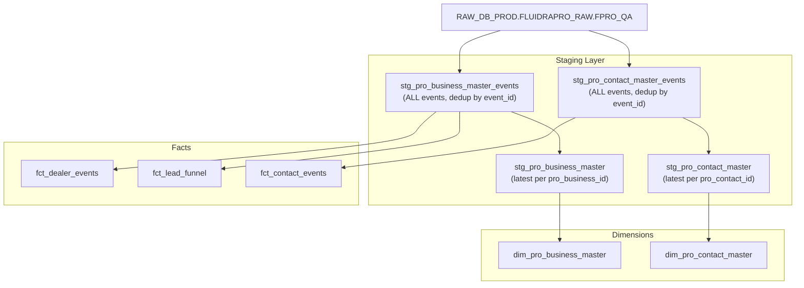

# Staging Events & Facts — Clean Design

## Design Principle

RAW is parsed ONCE in the events staging model. Everything downstream reads from staging — never from RAW directly.



---

## 1. stg_pro_business_master_events (ALL events)

**Grain:** One row per `event_id` (every business event preserved, Kafka duplicates removed)

```sql
CREATE OR REPLACE VIEW ANALYTICS_DB_DEV.INTERMEDIATE.STG_PRO_BUSINESS_MASTER_EVENTS AS
WITH source AS (
    SELECT
        PARSE_JSON(C1) AS metadata_json,
        PARSE_JSON(C2) AS payload
    FROM RAW_DB_PROD.FLUIDRAPRO_RAW.FPRO_QA
    WHERE C1 != 'RECORD_METADATA'
      AND PARSE_JSON(C2):"detail-type"::STRING LIKE '%pro-business%'
)
SELECT
    -- Event envelope
    payload:id::STRING AS event_id,
    payload:"detail-type"::STRING AS event_detail_type,
    payload:time::TIMESTAMP_NTZ AS event_time,
    payload:time::DATE AS event_date,
    payload:source::STRING AS event_source,
    payload:region::STRING AS event_region,

    -- Kafka metadata
    metadata_json:offset::NUMBER AS kafka_offset,
    metadata_json:partition::NUMBER AS kafka_partition,
    metadata_json:topic::STRING AS kafka_topic,

    -- Event metadata
    payload:detail.metadata.eventType::STRING AS metadata_event_type,
    payload:detail.metadata.correlationId::STRING AS correlation_id,
    payload:detail.metadata.service::STRING AS metadata_service,
    payload:detail.metadata.subDomain::STRING AS metadata_sub_domain,
    payload:detail.metadata.payloadVersion::STRING AS payload_version,

    -- Business identity
    payload:detail.data.proBusinessId::STRING AS pro_business_id,
    payload:detail.data.businessName::STRING AS business_name,
    payload:detail.data.doingBusinessAs::STRING AS doing_business_as,
    payload:detail.data.status::STRING AS business_status,
    payload:detail.data.loginStatus::STRING AS login_status,
    payload:detail.data.source::STRING AS registration_source,

    -- Classification
    payload:detail.data.customerType::STRING AS customer_type,
    payload:detail.data.primaryBusinessType::STRING AS primary_business_type,
    payload:detail.data.businessSegment::STRING AS business_segment,
    payload:detail.data.channel::STRING AS channel,
    payload:detail.data.customerClass::STRING AS customer_class,
    payload:detail.data.salesChannel::STRING AS sales_channel,

    -- Contact info
    payload:detail.data.primaryBusinessEmail::STRING AS primary_business_email,
    payload:detail.data.primaryBusinessPhoneNumber::STRING AS primary_business_phone,

    -- Key account
    payload:detail.data.isPrimaryKeyAccount::BOOLEAN AS is_primary_key_account,
    payload:detail.data.keyAccountTypeName::STRING AS key_account_type_name,

    -- External keys
    payload:detail.data.fluidraAccountNumber::STRING AS fluidra_account_number,
    payload:detail.data.crmLeadId::STRING AS crm_lead_id,
    payload:detail.data.webAccountId::STRING AS web_account_id,

    -- Flags
    payload:detail.data.termsAccepted::BOOLEAN AS terms_accepted,
    payload:detail.data.eStatementEnabled::BOOLEAN AS e_statement_enabled,
    payload:detail.data.isMarComConsent::BOOLEAN AS is_marcom_consent,
    payload:detail.data.tseViolator::BOOLEAN AS tse_violator,

    -- Rewards (scalar attributes from embedded object)
    payload:detail.data.rewardsAccount.programLevel::STRING AS rewards_program_level,
    payload:detail.data.rewardsAccount.achieverLevel::STRING AS rewards_achiever_level,
    payload:detail.data.rewardsAccount.programStatus::STRING AS rewards_program_status,
    payload:detail.data.rewardsAccount.rebatePayType::STRING AS rewards_rebate_pay_type,
    TRY_TO_TIMESTAMP_NTZ(payload:detail.data.rewardsAccount.programSignupDate::STRING) AS rewards_signup_date,

    -- Primary contact (embedded)
    payload:detail.data.primaryContact.proContactId::STRING AS primary_contact_id,
    payload:detail.data.primaryContact.contactType::STRING AS primary_contact_type,
    payload:detail.data.primaryContact.loginStatus::STRING AS primary_contact_login_status,
    TRY_TO_TIMESTAMP_NTZ(payload:detail.data.primaryContact.lastLoginDate::STRING) AS primary_contact_last_login,

    -- Location
    payload:detail.data.primaryBillingLocation.proLocationId::STRING AS billing_location_id,
    payload:detail.data.primaryBillingLocation.address.city::STRING AS billing_city,
    payload:detail.data.primaryBillingLocation.address.state::STRING AS billing_state,

    -- Sales rep
    payload:detail.data.salesRep.name::STRING AS sales_rep_name,
    payload:detail.data.salesRep.email::STRING AS sales_rep_email,

    -- UTM
    payload:detail.data.utm.utm_source::STRING AS utm_source,
    payload:detail.data.utm.utm_medium::STRING AS utm_medium,
    payload:detail.data.utm.utm_campaign::STRING AS utm_campaign,

    -- Array sizes (measures)
    COALESCE(ARRAY_SIZE(payload:detail.data.distributors), 0) AS distributor_count,
    COALESCE(ARRAY_SIZE(payload:detail.data.programOptIns), 0) AS program_opt_in_count,
    COALESCE(ARRAY_SIZE(payload:detail.data.subscriptions), 0) AS subscription_count,

    -- Event type flags
    CASE WHEN payload:detail.metadata.eventType::STRING = 'created' THEN 1 ELSE 0 END AS is_created_event,
    CASE WHEN payload:detail.metadata.eventType::STRING = 'updated' THEN 1 ELSE 0 END AS is_updated_event,
    CASE WHEN payload:detail.metadata.eventType::STRING = 'approved' THEN 1 ELSE 0 END AS is_approved_event,
    CASE WHEN payload:detail.metadata.eventType::STRING = 'rejected' THEN 1 ELSE 0 END AS is_rejected_event,
    CASE WHEN payload:"detail-type"::STRING LIKE '%creation-failed%' THEN 1 ELSE 0 END AS is_creation_failed,
    CASE WHEN payload:"detail-type"::STRING LIKE '%update-requested%' THEN 1 ELSE 0 END AS is_update_requested,
    CASE WHEN payload:"detail-type"::STRING LIKE '%lead.approved%' THEN 1 ELSE 0 END AS is_lead_approved,
    CASE WHEN payload:"detail-type"::STRING LIKE '%lead.rejected%' THEN 1 ELSE 0 END AS is_lead_rejected,

    -- Funnel stage (derived)
    CASE
        WHEN payload:"detail-type"::STRING LIKE '%created%' AND payload:detail.data.status::STRING = 'GUEST' THEN 'GUEST'
        WHEN payload:"detail-type"::STRING LIKE '%created%' AND payload:detail.data.status::STRING = 'LEAD' THEN 'LEAD_CREATED'
        WHEN payload:"detail-type"::STRING LIKE '%created%' THEN 'BUSINESS_CREATED'
        WHEN payload:"detail-type"::STRING = 'fluidrapro.pro-business-lead.approved.v1' THEN 'LEAD_APPROVED'
        WHEN payload:"detail-type"::STRING = 'fluidrapro.pro-business-master.approved.v1' THEN 'BUSINESS_APPROVED'
        WHEN payload:"detail-type"::STRING LIKE '%lead.rejected%' THEN 'LEAD_REJECTED'
        WHEN payload:"detail-type"::STRING LIKE '%master.rejected%' THEN 'BUSINESS_REJECTED'
        WHEN payload:"detail-type"::STRING LIKE '%creation-failed%' THEN 'CREATION_FAILED'
        WHEN payload:"detail-type"::STRING LIKE '%update-requested%' THEN 'UPDATE_REQUESTED'
        ELSE 'UPDATED'
    END AS funnel_stage,

    -- Timing measure
    DATEDIFF('second',
        TRY_TO_TIMESTAMP_NTZ(payload:detail.data.auditInfo.createdAt::STRING),
        payload:time::TIMESTAMP_NTZ
    ) AS seconds_in_stage,

    -- Failure detail
    payload:detail.data.reason::STRING AS failure_reason,

    -- Audit
    TRY_TO_TIMESTAMP_NTZ(payload:detail.data.auditInfo.createdAt::STRING) AS record_created_at,
    payload:detail.data.auditInfo.createdBy::STRING AS record_created_by

FROM source
QUALIFY ROW_NUMBER() OVER (PARTITION BY payload:id::STRING ORDER BY metadata_json:offset::NUMBER DESC) = 1;
```

---

## 2. stg_pro_business_master (latest state — from events staging)

**Grain:** One row per `pro_business_id` (latest event wins)

```sql
CREATE OR REPLACE VIEW ANALYTICS_DB_DEV.INTERMEDIATE.STG_PRO_BUSINESS_MASTER AS
SELECT *
FROM ANALYTICS_DB_DEV.INTERMEDIATE.STG_PRO_BUSINESS_MASTER_EVENTS
WHERE pro_business_id IS NOT NULL
  AND event_detail_type LIKE '%pro-business-master%'
QUALIFY ROW_NUMBER() OVER (
    PARTITION BY pro_business_id
    ORDER BY event_time DESC, kafka_offset DESC
) = 1;
```

**Note:** Reads FROM the events staging — not from RAW. Single parse, no duplication.

---

## 3. stg_pro_contact_master_events (ALL contact events)

**Grain:** One row per `event_id`

```sql
CREATE OR REPLACE VIEW ANALYTICS_DB_DEV.INTERMEDIATE.STG_PRO_CONTACT_MASTER_EVENTS AS
WITH source AS (
    SELECT
        PARSE_JSON(C1) AS metadata_json,
        PARSE_JSON(C2) AS payload
    FROM RAW_DB_PROD.FLUIDRAPRO_RAW.FPRO_QA
    WHERE C1 != 'RECORD_METADATA'
      AND PARSE_JSON(C2):"detail-type"::STRING LIKE '%pro-contact-master%'
)
SELECT
    payload:id::STRING AS event_id,
    payload:"detail-type"::STRING AS event_detail_type,
    payload:time::TIMESTAMP_NTZ AS event_time,
    payload:time::DATE AS event_date,
    metadata_json:offset::NUMBER AS kafka_offset,
    metadata_json:partition::NUMBER AS kafka_partition,

    payload:detail.metadata.eventType::STRING AS metadata_event_type,
    payload:detail.metadata.correlationId::STRING AS correlation_id,
    payload:detail.metadata.service::STRING AS metadata_service,

    payload:detail.data.proContactId::STRING AS pro_contact_id,
    payload:detail.data.proBusinessId::STRING AS pro_business_id,
    payload:detail.data.contactType::STRING AS contact_type,
    payload:detail.data.firstName::STRING AS first_name,
    payload:detail.data.lastName::STRING AS last_name,
    payload:detail.data.email::STRING AS email,
    payload:detail.data.phoneNumber::STRING AS phone_number,
    payload:detail.data.loginStatus::STRING AS login_status,
    payload:detail.data.username::STRING AS username,
    payload:detail.data.cognitoSubId::STRING AS cognito_sub_id,
    payload:detail.data.webUserId::STRING AS web_user_id,
    TRY_TO_TIMESTAMP_NTZ(payload:detail.data.lastLoginDate::STRING) AS last_login_date,
    payload:detail.data.status::STRING AS contact_status,

    COALESCE(ARRAY_SIZE(payload:detail.data.locations), 0) AS assigned_location_count,
    COALESCE(ARRAY_SIZE(payload:detail.data.userSubscriptions), 0) AS user_subscription_count,

    CASE WHEN payload:"detail-type"::STRING LIKE '%created.v1' THEN 1 ELSE 0 END AS is_created_event,
    CASE WHEN payload:"detail-type"::STRING LIKE '%updated.v1' THEN 1 ELSE 0 END AS is_updated_event,
    CASE WHEN payload:"detail-type"::STRING LIKE '%login-created%' THEN 1 ELSE 0 END AS is_login_created_event,
    CASE WHEN payload:"detail-type"::STRING LIKE '%deleted%' THEN 1 ELSE 0 END AS is_deleted_event,

    TRY_TO_TIMESTAMP_NTZ(payload:detail.data.auditInfo.createdAt::STRING) AS record_created_at,
    payload:detail.data.auditInfo.createdBy::STRING AS record_created_by

FROM source
WHERE payload:detail.data.proContactId IS NOT NULL
QUALIFY ROW_NUMBER() OVER (PARTITION BY payload:id::STRING ORDER BY metadata_json:offset::NUMBER DESC) = 1;
```

---

## 4. stg_pro_contact_master (latest state — from events staging)

**Grain:** One row per `pro_contact_id`

```sql
CREATE OR REPLACE VIEW ANALYTICS_DB_DEV.INTERMEDIATE.STG_PRO_CONTACT_MASTER AS
SELECT *
FROM ANALYTICS_DB_DEV.INTERMEDIATE.STG_PRO_CONTACT_MASTER_EVENTS
QUALIFY ROW_NUMBER() OVER (
    PARTITION BY pro_contact_id
    ORDER BY event_time DESC, kafka_offset DESC
) = 1;
```

---

## 5. fct_dealer_events (reads from staging — not RAW)

**Grain:** One row per business event

```sql
CREATE OR REPLACE VIEW ANALYTICS_DB_DEV.FACTS.FCT_DEALER_EVENTS AS
SELECT
    event_id,
    event_detail_type,
    event_time,
    event_date,
    kafka_offset,
    metadata_event_type,
    correlation_id,
    pro_business_id,
    primary_contact_id,
    billing_location_id,
    business_status,
    login_status,
    registration_source,
    primary_business_type,
    business_segment,
    distributor_count,
    program_opt_in_count,
    subscription_count,
    is_created_event,
    is_updated_event,
    is_approved_event,
    is_rejected_event,
    is_creation_failed,
    is_update_requested,
    utm_source,
    utm_medium,
    utm_campaign,
    failure_reason,
    record_created_at
FROM ANALYTICS_DB_DEV.INTERMEDIATE.STG_PRO_BUSINESS_MASTER_EVENTS
WHERE event_detail_type LIKE '%pro-business-master%';
```

---

## 6. fct_lead_funnel (reads from staging — not RAW)

**Grain:** One row per funnel stage transition

```sql
CREATE OR REPLACE VIEW ANALYTICS_DB_DEV.FACTS.FCT_LEAD_FUNNEL AS
SELECT
    event_id,
    event_detail_type,
    event_time,
    event_date,
    pro_business_id,
    primary_business_email,
    crm_lead_id,
    sales_rep_name,
    sales_rep_email,
    business_status,
    primary_business_type,
    registration_source,
    funnel_stage,
    seconds_in_stage,
    failure_reason,
    record_created_at
FROM ANALYTICS_DB_DEV.INTERMEDIATE.STG_PRO_BUSINESS_MASTER_EVENTS
WHERE funnel_stage != 'UPDATED';
```

---

## 7. fct_contact_events (reads from staging — not RAW)

**Grain:** One row per contact event

```sql
CREATE OR REPLACE VIEW ANALYTICS_DB_DEV.FACTS.FCT_CONTACT_EVENTS AS
SELECT
    event_id,
    event_detail_type,
    event_time,
    event_date,
    kafka_offset,
    metadata_event_type,
    correlation_id,
    pro_contact_id,
    pro_business_id,
    contact_type,
    login_status,
    contact_status,
    email,
    is_created_event,
    is_updated_event,
    is_login_created_event,
    is_deleted_event,
    record_created_at
FROM ANALYTICS_DB_DEV.INTERMEDIATE.STG_PRO_CONTACT_MASTER_EVENTS;
```

---

## Summary: Before vs After

| Aspect | Before | After |
|--------|--------|-------|
| RAW parsed by | Staging (for dim) + Fact (separately) | Staging events model ONLY |
| JSON parsing locations | 2 (duplicated) | 1 (single source) |
| Field mapping maintained in | 2 places | 1 place |
| Fact reads from | RAW directly | Staging (proper lineage) |
| Dim reads from | RAW directly | Latest-state staging (which reads from events staging) |
| dbt DAG | RAW → staging, RAW → fact (parallel, duplicated) | RAW → events staging → fact + dim (linear, clean) |

---

## Model Inventory (Updated)

| Model | Grain | Purpose | Downstream |
|-------|-------|---------|-----------|
| `stg_pro_business_master_events` | 1 per event_id | All business events parsed | fct_dealer_events, fct_lead_funnel, stg_pro_business_master |
| `stg_pro_business_master` | 1 per pro_business_id | Latest state | dim_pro_business_master |
| `stg_pro_contact_master_events` | 1 per event_id | All contact events parsed | fct_contact_events, stg_pro_contact_master |
| `stg_pro_contact_master` | 1 per pro_contact_id | Latest state | dim_pro_contact_master |
| `stg_pro_associated_distributor` | 1 per (biz, dist, acct#) | Flattened distributors | dim_pro_associated_distributor |
| `stg_pro_program_opt_in` | 1 per (biz, program) | Flattened programs | dim_pro_program_opt_in |
| `stg_pro_subscription_master` | 1 per (biz, sub_id) | Flattened subscriptions | dim_pro_subscription_master |
| `stg_pro_business_location_master` | 1 per location_id | Locations | dim_pro_business_location_master |
| `stg_pro_key_account_type` | 1 per type_id | Key account types | dim_key_account_type |
| `stg_pro_reconciliation` | 1 per run | Pipeline health | fct_reconciliation |
