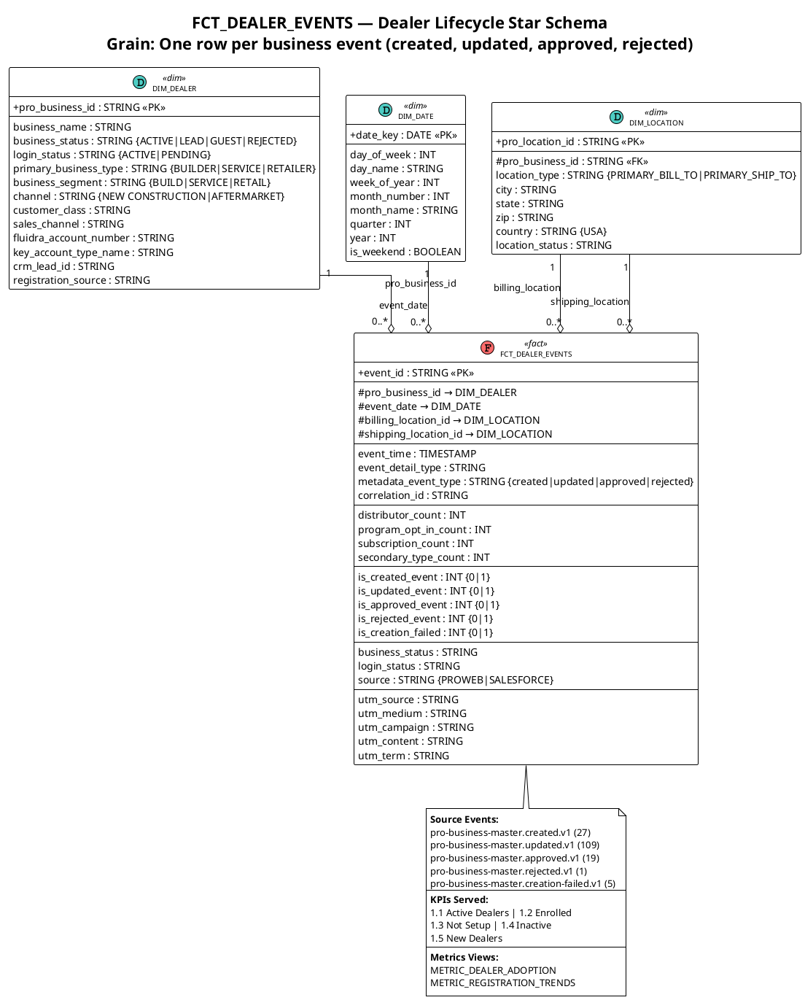
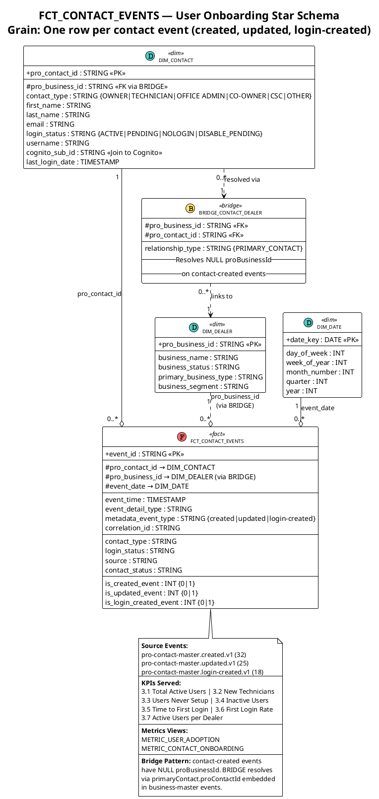
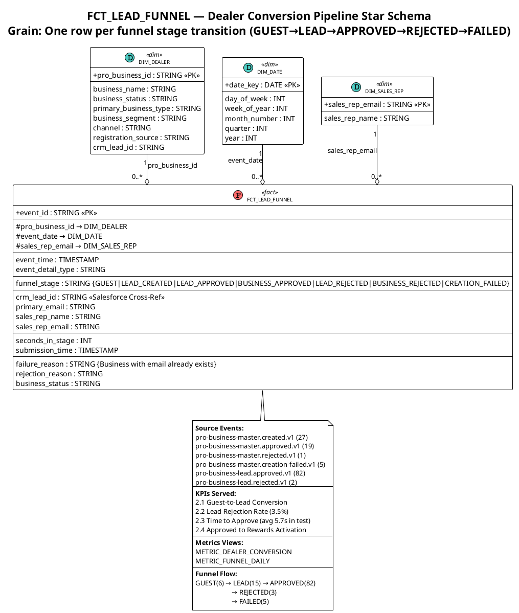
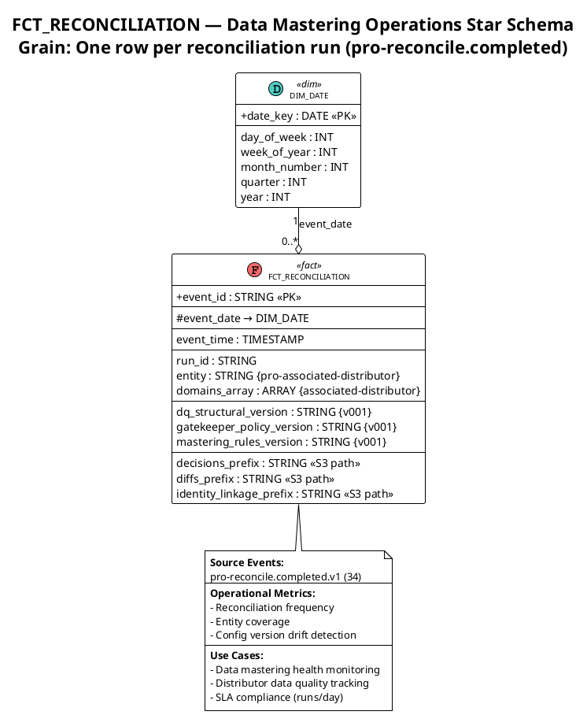

# Star Schema Diagrams — Per Fact Table (PlantUML)

> **Purpose:** Clean, focused star schema diagrams — one per fact table with only its related dimensions.
> **Render:** Paste each `@startuml...@enduml` block into [plantuml.com](https://www.plantuml.com/plantuml), VS Code PlantUML extension, or IntelliJ.

---

## 1. FCT_DEALER_EVENTS

**Grain:** One row per business-level event | **Load:** Real-time (Kafka/Snowpipe) | **Dimensions:** 5

---

## 2. FCT_CONTACT_EVENTS

**Grain:** One row per contact-level event | **Load:** Real-time (Kafka/Snowpipe) | **Dimensions:** 4

---

## 3. FCT_LEAD_FUNNEL

**Grain:** One row per funnel stage transition | **Load:** Real-time (Kafka/Snowpipe) | **Dimensions:** 3

---

## 4. FCT_RECONCILIATION

**Grain:** One row per reconciliation run | **Load:** Event-driven | **Dimensions:** 1

---

## 5. Combined Model — All Facts with Conformed Dimensions

**All 4 fact tables sharing conformed dimensions in a single constellation schema.**

```plantuml
@startuml fluidra_constellation_schema
!theme plain
title Fluidra Pro Analytics — Constellation Schema (All Facts)\nSource: EVENTS__RAW_FLUIDRA | 363 events | 45 businesses | 13 event types

skinparam linetype ortho
skinparam classAttributeIconSize 0
skinparam classFontSize 9

' ============================================================
' CONFORMED DIMENSIONS (shared across facts)
' ============================================================

class DIM_DEALER <<(D,#4ECDC4) dim>> {
    + pro_business_id : STRING <<PK>>
    --
    business_name : STRING
    business_status : STRING {ACTIVE|LEAD|GUEST|REJECTED}
    login_status : STRING {ACTIVE|PENDING}
    primary_business_type : STRING {BUILDER|SERVICE|RETAILER}
    business_segment : STRING {BUILD|SERVICE|RETAIL}
    channel : STRING {NEW CONSTRUCTION|AFTERMARKET}
    customer_class : STRING
    sales_channel : STRING
    fluidra_account_number : STRING <<Revenue Join Key>>
    key_account_type_name : STRING
    crm_lead_id : STRING <<Salesforce Join Key>>
    registration_source : STRING {PROWEB|SALESFORCE}
    created_at : TIMESTAMP
}

class DIM_CONTACT <<(D,#4ECDC4) dim>> {
    + pro_contact_id : STRING <<PK>>
    # pro_business_id : STRING <<FK>>
    --
    contact_type : STRING {OWNER|TECHNICIAN|OFFICE ADMIN|CO-OWNER|CSC|OTHER}
    first_name : STRING
    last_name : STRING
    email : STRING
    login_status : STRING {ACTIVE|PENDING|NOLOGIN|DISABLE_PENDING}
    cognito_sub_id : STRING <<Cognito Join Key>>
    last_login_date : TIMESTAMP
}

class DIM_LOCATION <<(D,#4ECDC4) dim>> {
    + pro_location_id : STRING <<PK>>
    # pro_business_id : STRING <<FK>>
    --
    location_type : STRING {BILL_TO|SHIP_TO}
    city : STRING
    state : STRING
    zip : STRING
    country : STRING
}

class DIM_PROGRAM <<(D,#4ECDC4) dim>> {
    + pro_business_id : STRING <<PK, 1:1>>
    --
    program_level : STRING
    achiever_level : STRING
    program_status : STRING {ACTIVE|PENDING}
    rebate_pay_type : STRING
    program_signup_date : TIMESTAMP
}

class DIM_DISTRIBUTOR <<(D,#4ECDC4) dim>> {
    # pro_business_id : STRING <<FK>>
    distributor_name : STRING
    distributor_account_number : STRING
    --
    distributor_account_status : STRING
    source : STRING {MANUAL|PROWEB}
    active_date : TIMESTAMP
}

class DIM_PROGRAM_OPT_IN <<(D,#4ECDC4) dim>> {
    # pro_business_id : STRING <<FK>>
    program_name : STRING
    --
    program_status : STRING {ACTIVE|PENDING|DECLINED}
    program_opt_in_date : TIMESTAMP
}

class DIM_SUBSCRIPTION <<(D,#4ECDC4) dim>> {
    + subscription_id : STRING <<PK>>
    # pro_business_id : STRING <<FK>>
    --
    subscription_name : STRING {ION POOL CARE}
    subscription_status : STRING
}

class DIM_SALES_REP <<(D,#4ECDC4) dim>> {
    + sales_rep_email : STRING <<PK>>
    --
    sales_rep_name : STRING
}

class DIM_DATE <<(D,#4ECDC4) dim>> {
    + date_key : DATE <<PK>>
    --
    day_of_week : INT
    week_of_year : INT
    month_number : INT
    quarter : INT
    year : INT
    is_weekend : BOOLEAN
}

class BRIDGE_CONTACT_DEALER <<(B,#FFE66D) bridge>> {
    # pro_business_id : STRING <<FK>>
    # pro_contact_id : STRING <<FK>>
    --
    relationship_type : STRING
}

' ============================================================
' FACT TABLES
' ============================================================

class FCT_DEALER_EVENTS <<(F,#FF6B6B) fact>> {
    + event_id : STRING <<PK>>
    # pro_business_id <<FK>>
    # event_date <<FK>>
    # billing_location_id <<FK>>
    --
    event_time : TIMESTAMP
    distributor_count : INT
    program_opt_in_count : INT
    is_created / approved / rejected : INT
    utm_source / campaign : STRING
}

class FCT_CONTACT_EVENTS <<(F,#FF6B6B) fact>> {
    + event_id : STRING <<PK>>
    # pro_contact_id <<FK>>
    # pro_business_id <<FK>>
    # event_date <<FK>>
    --
    event_time : TIMESTAMP
    contact_type : STRING
    is_created_event : INT
    is_login_created_event : INT
}

class FCT_LEAD_FUNNEL <<(F,#FF6B6B) fact>> {
    + event_id : STRING <<PK>>
    # pro_business_id <<FK>>
    # event_date <<FK>>
    # sales_rep_email <<FK>>
    --
    event_time : TIMESTAMP
    funnel_stage : STRING
    seconds_in_stage : INT
    crm_lead_id : STRING
    failure_reason : STRING
}

class FCT_RECONCILIATION <<(F,#FF6B6B) fact>> {
    + event_id : STRING <<PK>>
    # event_date <<FK>>
    --
    run_id : STRING
    entity : STRING
    config_versions : STRING
}

' ============================================================
' METRIC VIEWS
' ============================================================

class METRIC_DEALER_ADOPTION <<(M,#81C784) metric>> {
    KPI 1.1-1.5
    active | enrolled | not_setup
    inactive | new_dealers
}

class METRIC_DEALER_CONVERSION <<(M,#81C784) metric>> {
    KPI 2.1-2.4
    guest_to_lead | rejection_rate
    approve_time | activation_time
}

class METRIC_USER_ADOPTION <<(M,#81C784) metric>> {
    KPI 3.1-3.7
    active_users | technicians
    never_setup | login_rate
    users_per_dealer
}

class METRIC_DEALER_HEALTH <<(M,#81C784) metric>> {
    Per-dealer scorecard
    health_status
    days_since_login
}

class METRIC_FUNNEL_DAILY <<(M,#81C784) metric>> {
    Daily volumes & rates
    approval_rate_pct
}

class METRIC_PROGRAM_ENROLLMENT <<(M,#81C784) metric>> {
    By program
    activation_rate_pct
}

class METRIC_DISTRIBUTOR_COVERAGE <<(M,#81C784) metric>> {
    By distributor
    active_rate_pct
}

class METRIC_CONTACT_ONBOARDING <<(M,#81C784) metric>> {
    By contact_type
    first_login_rate_pct
}

class METRIC_REGISTRATION_TRENDS <<(M,#81C784) metric>> {
    Weekly new dealers
    failure_rate_pct
}

' ============================================================
' RELATIONSHIPS: Dimension → Dimension
' ============================================================
DIM_DEALER "1" --o "0..*" DIM_CONTACT
DIM_DEALER "1" --o "0..*" DIM_LOCATION
DIM_DEALER "1" --o "0..*" DIM_DISTRIBUTOR
DIM_DEALER "1" -- "1" DIM_PROGRAM
DIM_DEALER "1" --o "0..*" DIM_PROGRAM_OPT_IN
DIM_DEALER "1" --o "0..*" DIM_SUBSCRIPTION
DIM_CONTACT "0..*" ..> "1" BRIDGE_CONTACT_DEALER
BRIDGE_CONTACT_DEALER "0..*" ..> "1" DIM_DEALER

' ============================================================
' RELATIONSHIPS: Dimension → Fact
' ============================================================
DIM_DEALER "1" --o "0..*" FCT_DEALER_EVENTS
DIM_DEALER "1" --o "0..*" FCT_LEAD_FUNNEL
DIM_CONTACT "1" --o "0..*" FCT_CONTACT_EVENTS
DIM_LOCATION "1" --o "0..*" FCT_DEALER_EVENTS
DIM_SALES_REP "1" ..o "0..*" FCT_LEAD_FUNNEL
DIM_DATE "1" ..o "0..*" FCT_DEALER_EVENTS
DIM_DATE "1" ..o "0..*" FCT_CONTACT_EVENTS
DIM_DATE "1" ..o "0..*" FCT_LEAD_FUNNEL
DIM_DATE "1" ..o "0..*" FCT_RECONCILIATION

' ============================================================
' RELATIONSHIPS: Fact → Metric
' ============================================================
FCT_DEALER_EVENTS ..> METRIC_DEALER_ADOPTION
FCT_DEALER_EVENTS ..> METRIC_REGISTRATION_TRENDS
FCT_LEAD_FUNNEL ..> METRIC_DEALER_CONVERSION
FCT_LEAD_FUNNEL ..> METRIC_FUNNEL_DAILY
FCT_CONTACT_EVENTS ..> METRIC_USER_ADOPTION
FCT_CONTACT_EVENTS ..> METRIC_CONTACT_ONBOARDING
DIM_PROGRAM_OPT_IN ..> METRIC_PROGRAM_ENROLLMENT
DIM_DISTRIBUTOR ..> METRIC_DISTRIBUTOR_COVERAGE
DIM_DEALER ..> METRIC_DEALER_HEALTH

note bottom of DIM_DEALER
  **Central Hub of Star Schema**
  All dimensions and facts
  connect through pro_business_id
  --
  45 distinct businesses in test data
  13 event types observed
end note

note bottom of BRIDGE_CONTACT_DEALER
  **Bridge Pattern**
  Resolves broken FK where
  contact-created events have
  NULL proBusinessId. Extracted
  from business-master events
  where primaryContact is embedded.
end note
@enduml
```

---

## How to Render These Diagrams

| Method | Steps |
|--------|-------|
| **PlantUML Online** | Go to [plantuml.com/plantuml](https://www.plantuml.com/plantuml) → paste code between `@startuml` and `@enduml` |
| **VS Code** | Install "PlantUML" extension → open this file → place cursor in code block → Alt+D |
| **IntelliJ** | Built-in PlantUML plugin → right-click → "Show Diagram" |
| **CLI** | `java -jar plantuml.jar -tsvg "docs/deep-study/star-schema-per-fact.md"` → generates 5 SVG files |
| **Confluence** | Use PlantUML macro → paste individual diagram code |
| **GitHub** | Use [PlantUML GitHub Action](https://github.com/marketplace/actions/generate-plantuml) to auto-render on push |

---

## Diagram Summary

| # | Fact Table | Grain | Dims | KPIs | Events |
|---|-----------|-------|:----:|:----:|:------:|
| 1 | FCT_DEALER_EVENTS | Business event | 5 | 1.1–1.5 | 161 |
| 2 | FCT_CONTACT_EVENTS | Contact event | 4 | 3.1–3.7 | 75 |
| 3 | FCT_LEAD_FUNNEL | Funnel stage | 3 | 2.1–2.4 | 136 |
| 4 | FCT_RECONCILIATION | Recon run | 1 | Ops | 34 |
| 5 | **Combined** | All of above | **10** | **16/20** | **363** |

---

*Document Version: 1.0 | Created: 2026-06-30*
*5 star schema diagrams — 4 individual per fact + 1 combined constellation*
*Each shows only the dimensions directly connected to that fact*
